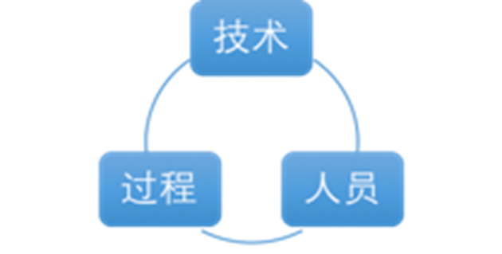
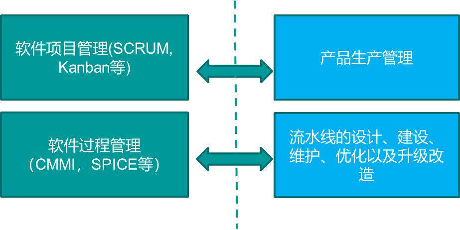
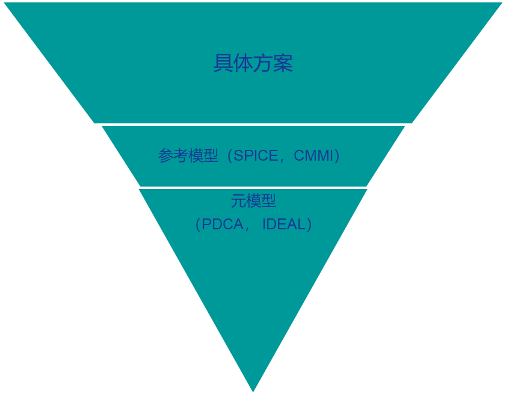
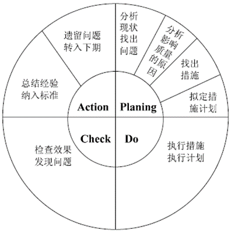
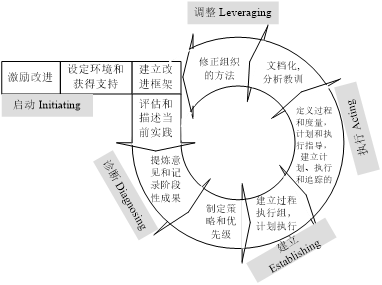
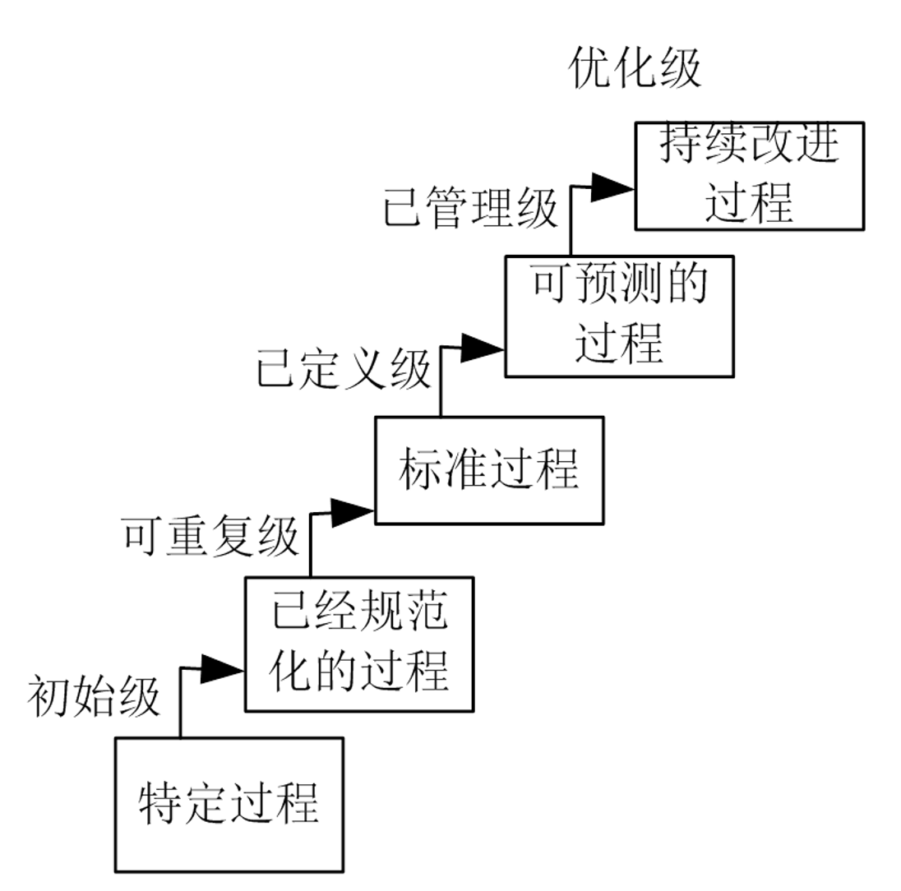
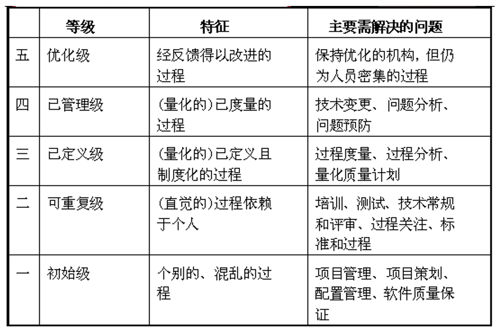
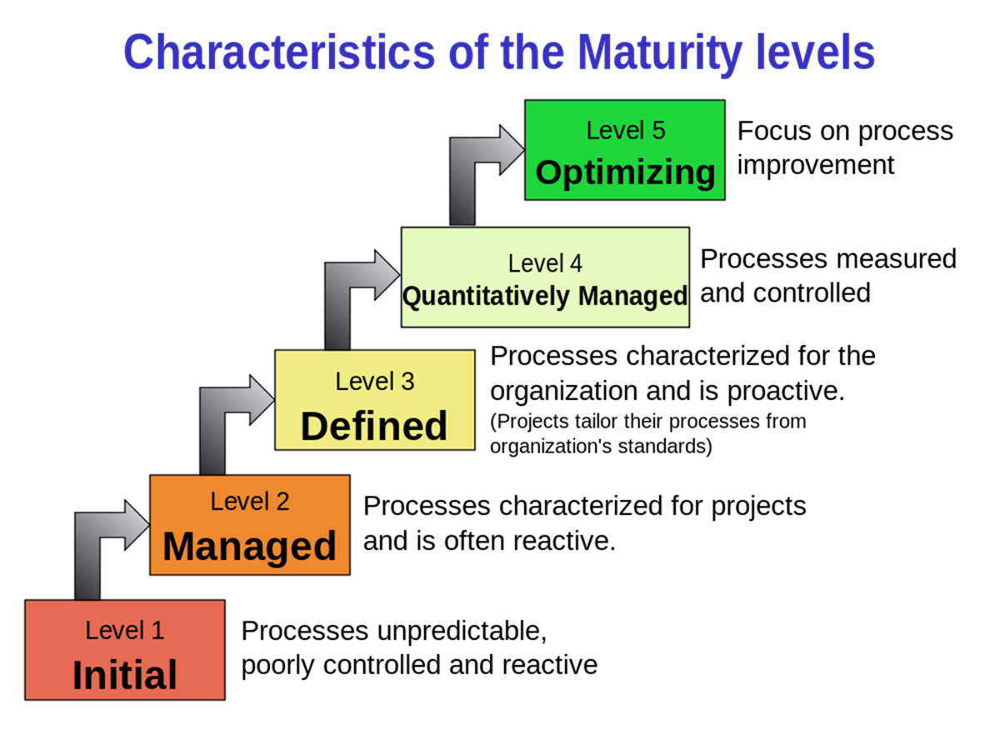

# 第01讲：软件质量与管理概述

- [ ] **软件自身规模的演变**：掌握 LOC/KLOC 度量及软件摩尔定律，理解规模带来的复杂度挑战。
- [ ] **软件危机与软件工程**：掌握软件危机表现（如 SAGE 焦油坑），厘清管理与技术两大视角。
- [ ] **Brooks 软件四大本质困难**：深入理解不可见性、复杂性、可变性、一致性及其关系。
- [ ] **管理与质量管理要素**：掌握管理闭环三要素，厘清质量实践与质量管理的本质区别。
- [ ] **CMM/CMMI 模型与 RUP 生命期**：熟练掌握 CMM/CMMI 五级成熟度及 RUP 四大阶段考点。

---

## 🔑 核心概念与详尽释义

### 1. 软件自身规模的演变
随着信息技术的飞速发展，软件在整个系统中的比例与规模呈指数级增长，将软件质量问题的影响上升到前所未有的高度。
* **度量方式**：通常采用 **LOC (Lines of Code，代码行数)** 或 **KLOC (千行代码数)** 进行规模度量。
* **软件业的摩尔定律 (Moore's Law for Software)**：
  大约每 **18个月** 软件的规模翻 **2倍**，每 **5年** 软件的规模翻 **10倍**。
* **规模带来的问题**：超大工程的内部组件依赖关系呈指数级增长，严重超出了单个工程师的智力负荷极限，从而必须依赖科学的管理方法与规范的过程。

### 2. 软件危机 (Software Crisis)
* **定义**：指落后的软件生产方式无法满足迅速增长的计算机软件需求，从而导致软件开发与维护过程中出现一系列严重问题的现象。
* **历史案例**：20世纪50年代的 **SAGE** 系统开发，由于规模巨大、复杂度极高，大批开发人员陷入了“**焦油坑 (Tar Pit)**”——如同垂死的野兽在焦油坑里挣扎，越用力陷得越深，时间和经费完全失控。
* **典型表现**：
  1. 软件开发费用和进度严重失控。
  2. 软件可靠性差，故障频发，维护成本极高。
  3. 用户对“已完成”系统不满意现象经常发生，甚至无法使用。

### 3. 软件工程 (Software Engineering)
* **定义**：是一门研究用工程化方法构建和维护有效的、实用的和高质量的软件的学科。
* **两大核心视角**：
  * **管理视角**：核心问题是“**成功是否可以复制？**”。关注如何利用规范化管理来降低各种无谓损耗，试图复制先前的成功。
  * **技术视角**：“是否可以将问题解决得更好？”研究具体的设计方法、开发工具与技术实践。

### 📊 软件项目管理的视角与演化
以下为关于软件过程、生命周期模型与过程管理体系的总体视角关系图：

---

## 💎 Brooks 的软件四大本质困难与挑战（核心考点）

根据 Fred Brooks 的经典著作《没有银弹》，软件开发面临四大永远存在、无法彻底根除 of 本质困难：
1. **不可见性 (Invisibility)**：软件项目是一个逻辑实体，没有物理形态，无法直观展示，导致跟踪和度量极为困难。
2. **复杂性 (Complexity)**：软件系统包含的元素极其众多，其关联性呈非线性爆炸，人的认知负荷存在极限。
3. **可变性 (Changeability)**：软件非常容易被修改，且用户、硬件和环境的不断变化迫使软件必须不断演化。
4. **一致性 (Conformity)**：软件必须屈就于现有的各种物理接口、遗留系统以及人的行为习惯。

### ⚠️ 核心关系与注意点
* **难题关系**：除了**不可见性**是软件所绝对共有的属性外，其他三个难题（复杂性、可变性、一致性）在不同项目中的凸显程度因项目而异。
* **难题演变**：这四大本质难题互相促进，其变化是推动软件工程方法和过程演变的根本动力。
* **心理因素**：软件开发本质上是一项**智力劳动**，开发者心理方面的因素和情绪状态对项目成败具有不可忽视的直接影响。

---

## 🛠️ 管理与质量管理的核心要素

### 1. 管理的三大关键要素
任何有效的管理活动，都必须包含以下三个闭环要素：
* **目标 (Goal)**：定下最终要达到的状态与标准。
* **状态 (Status)**：实时测量，了解当前所处的实际位置，判断是在接近目标还是在远离目标。
* **纠偏 (Correction)**：发现实际状态与目标偏离时，及时采取有效的调整措施。

### 2. ⚡ 质量实践 与 质量管理 的本质区别（高频考点）
* **质量实践 (Quality Practices)**：指具体的工程技术行为，例如编写单元测试、执行集成测试、代码审查（Code Review）等。
* **质量管理 (Quality Management)**：是指对产品质量进行的**闭环管理**。管理必须具备上述**“目标、状态、纠偏”**三要素（例如：制定缺陷率目标，跟踪各阶段缺陷注入/消除状态，并在超出控制线时进行流程纠偏）。

### 3. 广义软件过程
* **理论基石**：软件产品和服务的质量，很大程度上取决于生产和维护该软件或服务的过程的质量。
* **广义过程组成**：不仅包含狭义的开发步骤，还包括**技术、人员以及管理过程**。
* **净室 (Cleanroom) 方法与 CMM 的协同**：Cleanroom 工程过程和 CMM 管理过程互为补充。Cleanroom 更注重质量，更偏向于使用数学工具和形式化规范，而 CMM 侧重于管理过程。

---

## ⚖️ 对比分析：软件过程管理 VS. 软件项目管理

| 维度 | 软件项目管理 (Project Management) | 软件过程管理 (Process Management) |
| :--- | :--- | :--- |
| **管理对象** | 具体的**项目**和**产品** | 抽象的**软件过程** (流水线本身) |
| **工作类比** | 如何使用车间流水线生产出一批好车（产品生产） | 流水线本身的设计、建设、维护、优化以及升级改造 |
| **核心目的** | 实现本次项目的特定目标（工期、质量、成本的达成） | 提升流水线在开发效率、质量等方面的长期性能绩效 |
| **关注点** | 降低/减少各种无谓的损耗，实现本该有的性能 | 为了达到更好的效能，其中质量/缺陷是首要限制与目标 |
| **核心问题** | 本次项目能否按时、按质、不超预算地交付？ | **成功是否可以复制？** |

### 📊 软件开发（智力劳动）与传统生产（制造）的差异
直观体现二者管理视角核心问题（成功是否可以复制）的图示：

---

## 🔄 过程改进参考模型与元模型

* **过程管理参考模型**（用以度量过程能力）：CMM/CMMI、ISO/IEC 15504 (SPICE)。
* **过程改进元模型**（用以指导改进步骤）：
  * **PDCA 循环**（Plan $\rightarrow$ Do $\rightarrow$ Check $\rightarrow$ Act）。
  * **IDEAL 模型**（Initiating 初始 $\rightarrow$ Diagnosing 诊断 $\rightarrow$ Establishing 建立 $\rightarrow$ Acting 执行 $\rightarrow$ Leveraging 调整/学习）。

### 📊 过程管理/改进模型关系图
各过程改进模型及 ISO 9000 所处成熟度等级水平的对应图示：

### 📊 ISO/IEC 15504 (SPICE) 过程类别
SPICE 包含五种核心过程类别：
1. 客户-供应商（CUS）过程
2. 工程（ENG）过程
3. 支持（SUP）过程
4. 管理（MAN）过程
5. 组织（ORG）过程

### 📊 PDCA 循环与 IDEAL 改进元模型图示
下面是 PDCA 循环与 IDEAL 模型的流程图示：

---

## 📊 能力成熟度模型 (CMM) 级别详解

CMM 侧重于软件开发过程的管理及工程能力的提高与评估，分为五个级别：

### 📊 CMM 各成熟度级别特征详图
CMM 1-5 级组织特征与能否合理预测开发费用进度的对照细节：

### 1. 等级一：初始级 (Initial)
* **特点**：缺乏健全的软件工程管理制度。
* **特征**：每件事情都用特设的（ad-hoc）临时方法去做。项目成功高度依赖个人英雄主义。大部分行动只是应付危机（**救火文化**），缺乏计划。开发周期和费用完全不可预测。

### 2. 等级二：可重复级 (Repeatable)
* **特点**：基本的项目管理行为与技术已在相似项目中固化。
* **特征**：仔细追踪费用和进度。管理人员能从危机状态中解放出来，在问题演变成灾难前发现并采取修正行动。
* **与ISO 9000的关系**：获得 ISO 9000 标准认证的企业，通常具有 CMM 第 2~3 级的水平。

### 3. 等级三：已定义级 (Defined)
* **特点**：为软件生产过程编制了完整的文档，且过程已被明确定义并制度化。
* **特征**：软件过程的管理 and 技术两个层面都实现了标准化。普遍采用评审（Review）方法来保证质量。可以成功引入 CASE 等工程环境。
* **警告**：在第 1 级的混乱过程中引入高新技术，只会使危机驱动的过程变得更加混乱。

### 4. 等级四：已管理级 (Managed)
* **特点**：对每个项目都设定了明确的质量和生产目标。
* **特征**：使用**统计质量控制 (Statistical Quality Control)** 方法，收集度量数据（如每千行代码错误率）。管理部门能够科学区分随机偏差与具有深刻含义的过程波动，并进行修正。

### 5. 等级五：优化级 (Optimizing)
* **特点**：基于统计质量和过程控制技术，进入持续、主动的过程改进状态。
* **特征**：将各项目获得的知识融入正反馈循环，稳步提升生产率和降低缺陷率。

---

## 🚀 【2022Fall】能力成熟度模型集成 (CMMI)

CMMI（Capability Maturity Model Integration）刻画了软件团队由不成熟走向成熟的 Roadmap：

### 1. CMMI 五个等级详细特征
* **等级一：初始级 (Initial)**
  开发混乱，没有过程概念。高度依赖个人能力，项目成功带有极大的偶然性，救火文化盛行。
* **等级二：已管理级 (Managed)**
  项目小组体现出项目管理特征（项目计划、跟踪、需求管理、配置管理等）。能遵守计划与流程，有资源准备，权责到人，对过程进行监测和控制。
* **等级三：已定义级 (Defined)**
  公司层面有标准流程和规范。各项目组可以在此基础上进行合理裁剪，定义出适合本项目的过程。
  * 💡 **从 2 级升级到 3 级的原因**：固化最佳实践，方便不同项目小组之间分享和快速学习优秀经验。科学管理成为组织文化与财富。
* **等级四：定量管理级 (Quantitatively Managed)**
  项目管理实现数字化，构建**预测模型**，以统计过程控制（SPC）的手段来管理过程，降低项目实施在质量上的波动。
  * **管理特征差异**：2 级和 3 级关注的是**当前状态**的管理；而 4 级 and 5 级则是根据**预测模型估算未来结果**（未来状态）来提前进行管理。
* **等级五：优化级 (Optimizing)**
  利用信息主动预防次品，主动识别过程偏差，寻找根源并消除，改善流程，运用新技术进行持续优化。

### ⚖️ CMMI 理解误区与事实对比（考试高频点）

| 常见误区 | 科学事实与正确理解 |
| :--- | :--- |
| **误区一：** CMMI 是一种具体的开发方法或过程。 | **事实：** CMMI **不是**软件过程，也不是开发模型。它只是一组描述成熟软件组织特征的**准则**，指导过程改进，而不指导具体开发。 |
| **误区二：** CMMI 与敏捷开发（Agile）是水火不容的。 | **事实：** 这是一个**伪命题**。敏捷关注的是开发实践，而 CMMI 关注的是成熟度组织级特征。高成熟度企业完全可以使用敏捷开发作为其实践。 |
| **误区三：** CMMI 太重了，不适合互联网轻量开发。 | **事实：** CMMI 本身无所谓轻重，需要裁剪的是公司内部定义的开发流程和规范，而非 CMMI 模型本身。 |
| **误区四：** CMMI 只适合需求不变或少变的场合。 | **事实：** CMMI 与需求变化多寡无关。它是过程改进工具，只要有目标，任何变化的管理都可以适用。 |
| **误区五：** CMMI 等级可用于不同公司间的横向能力比较。 | **事实：** CMMI 衡量的是公司在**自身商业目标**下的相对能力，而非绝对技术实力。横向比较没有实际意义。（美国国防部招标一般要求企业达到 CMMI 3 级） |

---

## 🔄 RUP 软件开发生命周期

RUP（Rational 统一过程）是一种迭代式开发框架。其生命周期划分为四个连续的阶段：

#### 📊 RUP 阶段开发演进与交付成果
| 阶段名称 | 核心目标与交付成果 |
| :--- | :--- |
| **初始阶段 (Inception)** | 建立业务模型，定义最终产品视图，并且确定项目的范围。 |
| **精化阶段 (Elaboration)** | 设计并确定系统的体系结构（Architecture），制定项目计划，确定资源需求。 |
| **构建阶段 (Construction)** | 开发出所有构件和应用程序，把它们集成为客户需要的产品，并详尽测试所有功能。 |
| **移交阶段 (Transition)** | 把开发的产品提交给用户使用（如部署、培训、维护支持等）。 |

---

## ✍️ 练习题

### 思考题
1. 为什么说“软件过程管理”的核心目的在于复制成功？它与“项目管理”在对象和类比上有何不同？
2. CMMI 等级四（定量管理级）和等级三（已定义级）最关键的区别在于什么？请用预测模型的概念加以阐述。

### Q1 [多选] 根据 Fred Brooks 在《没有银弹》中关于软件四大本质困难的描述，下列哪些说法是正确的？
* A. 不可见性是软件项目作为逻辑实体的绝对属性，在所有项目中都同等存在
* B. 复杂性、可变性、一致性这三大本质难题的严重程度在不同项目中是完全相同的
* C. 过程模型和方法学（如敏捷、CMMI）的演化，从根本上说是受到本质难题变化的驱动
* D. 四大本质难题之间是孤立的，不存在互相促进或加剧的关系
* **正确答案**：AC

### Q2 [单选] 某公司为提升开发效率和质量，要求研发团队实施以下改动：(1) 在编码完成之后，强制推行结对审查与缺陷分析；(2) 引入静态代码分析工具；(3) 针对每次迭代，基于历史数据为各模块设定缺陷率上限值，并在控制图偏离上限时启动原因分析和流程优化。根据第一讲的定义，上述活动中属于“质量管理”范畴的是（ ）。
* A. 仅有 (3)
* B. 仅有 (1)(3)
* C. 仅有 (2)(3)
* D. (1)(2)(3) 全属于质量管理
* **正确答案**：A
* **解析**：质量管理必须包含“目标、状态、纠偏”三个闭环要素。活动(1)结对审查和活动(2)引入静态分析工具属于具体的工程技术实践，即“质量实践”；活动(3)设定目标（缺陷率上限）、监控状态（控制图）并执行纠偏（原因分析和流程优化），属于完整的闭环“质量管理”。

### Q3 [单选] 在 CMMI 过程改进评估中，软件组织从“CMMI 2级（已管理级）”向“CMMI 3级（已定义级）”演进的核心驱动力，以及这两个成熟度级别与更高级别（4级/5级）在管理视角上的本质区别分别是（ ）。
* A. 引入数字化技术以降低质量波动；2/3级根据模型预测未来，4/5级根据事实管理当前
* B. 固化并分享小组成熟实践以促成组织级资产共享；2/3级关注当前实际状态，4/5级依靠预测模型管理未来结果
* C. 摆脱救火文化以保证项目成功的偶然性；2/3级依赖个人英雄主义，4/5级依赖组织规范
* D. 为每个项目设定独立的质量目标以实现特设（ad-hoc）开发；二者均基于统计过程控制（SPC）
* **正确答案**：B
* **解析**：从 2 级升级到 3 级的核心原因在于固化最佳实践，并在组织（公司）层面形成标准流程和规范，以便不同项目组分享与裁剪，避免重复发明轮子。在管理视角上，CMMI 2级和3级侧重对当前已发生的实际状态进行管理与纠偏；而 4级和5级则是构建定量预测模型，根据未来可能发生的结果提前进行管理。
