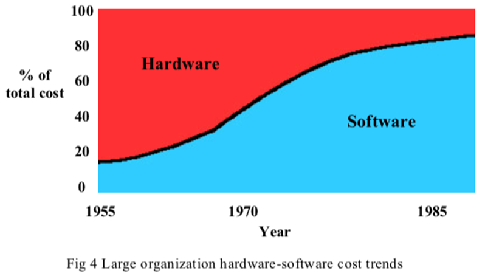
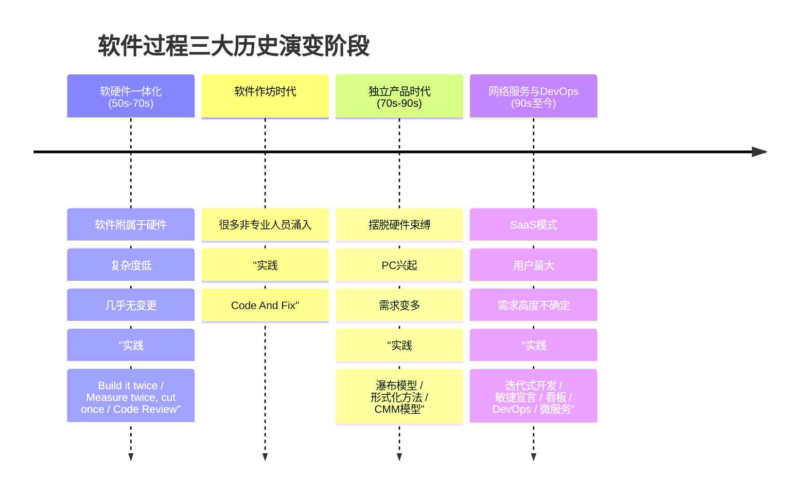
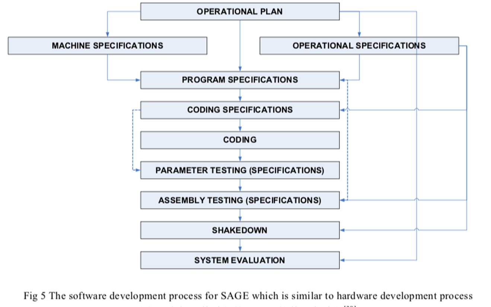
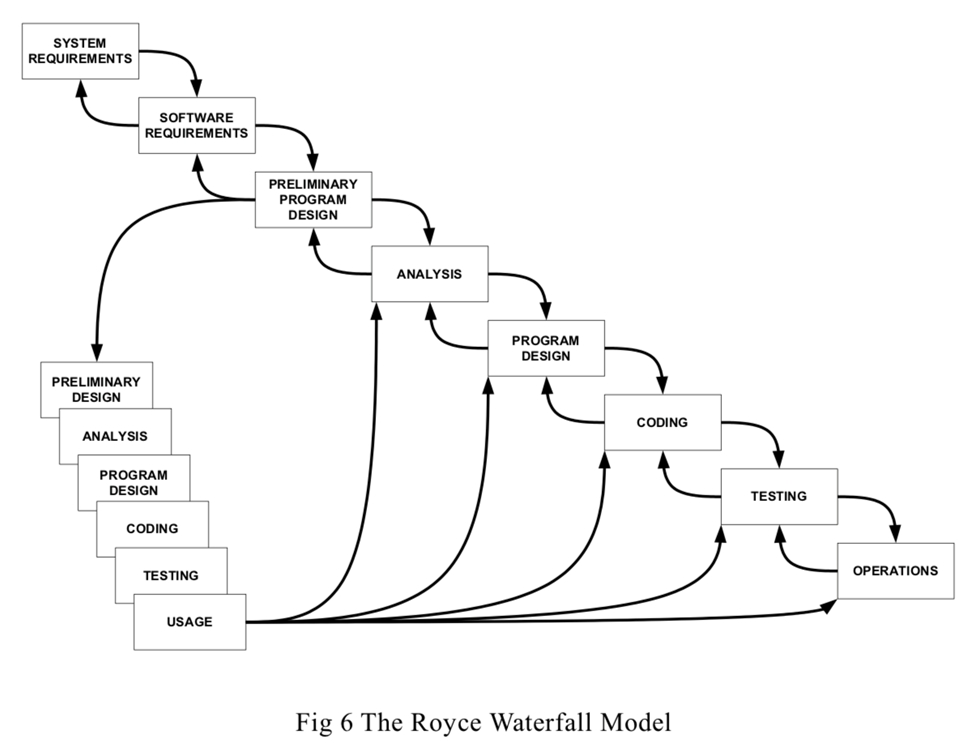
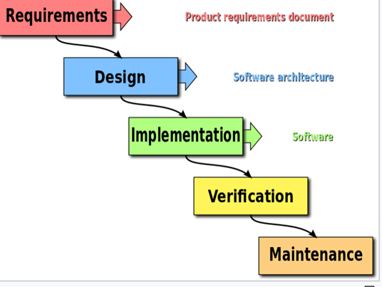
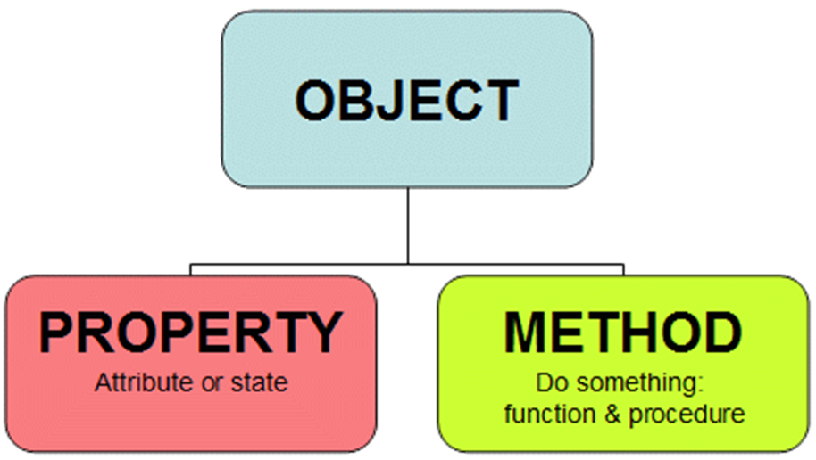
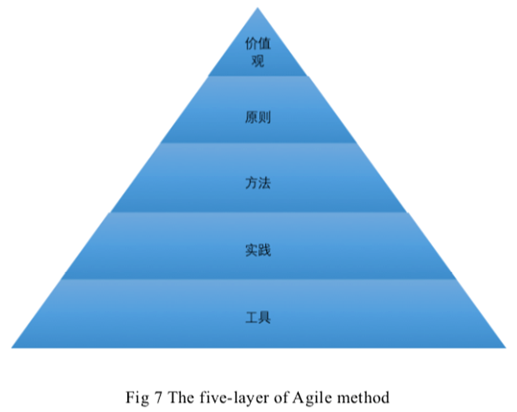
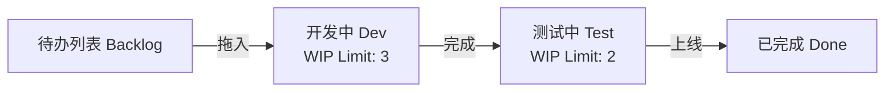

# 第02讲：软件过程的历史演变与经典工作

- [ ] **软件开发三大历史阶段**：掌握软硬件一体化阶段、独立产品时代、网络服务与 DevOps 时代的特征。
- [ ] **“Measure twice, cut once”背景**：理解在早期昂贵硬件限制下，代码评审与审查的工程背景。
- [ ] **经典过程模型与敏捷**：对比瀑布模型与迭代开发，熟记敏捷宣言 4 大核心价值观与 12 条原则。
- [ ] **看板方法与核心实践**：理解看板的核心原则（可视化、限制 WIP、管理流）与开源特征。
- [ ] **DevOps 体系**：掌握 DevOps 定义、核心三步法（流动、反馈、持续学习）与关键实践。

---

## 📅 软件发展的三个主要历史阶段（核心考点）

随着硬件能力的提升与应用领域的拓展，软件开发经历了三个主要阶段，其开发策略和核心关注点发生了深刻变化：

### 📊 软件历史演变阶段时间轴与关键实践

### 1. 软硬件一体化阶段（20世纪50年代 ~ 70年代）
* **应用特征**：软件完全依附于硬件，作为辅助硬件完成计算任务的工具。功能单一，复杂度有限，且**几乎不需要需求变更**。
* **开发特征**：硬件设备极其昂贵（占项目极大比例），团队以硬件工程师和数学家为主。
* **核心开发实践**：
  * **“Measure twice, cut once”（三思而后行）**：
    * *背景*：由于硬件出错的修改成本极大，硬件开发遵循“先精确测量，再动手裁剪”的原则。
    * *软件应用*：强调在应用更改之前仔细检查代码，在问题变成主要灾难之前将其识别并纠正。
  * **相同的软件工程实践**：在动手编码之前，必须做极其详尽的设计分析，**代码评审 (Code Review) 与审查 (Inspection)** 成为必不可少的工程关卡。
  * **整个过程特征**：呈现出**极强的线性特征**。
  * **“Build it twice”（做两遍）**：先做一个快速的原型系统或“第一版”（往往直接抛弃），借此探索技术难点并获取用户反馈，然后在吸取教训的基础上正式开发第二版。

### 2. 软件作坊阶段
* **应用特征**：功能简单，规模极小。
* **开发特征**：很多非专业领域的人员涌入软件开发领域，高级程序语言出现，质疑权威的软件文化盛行。
* **核心过程与实践**：
  * **Code And Fix (边做边改)**：没有系统性的计划、设计和维护。
  * **缺陷**：Code And Fix 不适合大型软件项目的开发，随着软件规模稍微扩大，便会导致费用和进度彻底失控，从而触发“软件危机”。

### 3. 软件成为独立产品阶段（20世纪70年代 ~ 90年代）
* **应用特征**：操作系统（OS）的出现使软件摆脱了硬件的直接束缚，软件成为独立的可交付产品。个人电脑（PC）普及，普通大众成为软件用户。功能和复杂度剧增，**需求多变，且兼容性要求和来自市场的竞争压力巨大**。
* **典型过程与工程实践**：
  * **形式化方法 (Formal Methods)**：将软件开发中的各种要素当作数学问题，进行数学化的规范定义与检验，主要解决软件的质量和正确性问题。但在扩展性（Scalability）和可用性（Usability）方面存在严重不足。
  * **结构化设计与瀑布模型**：自顶向下，逐步求精。将软件开发划分为明确、线性的需求、设计、编码、测试、维护等阶段。
    * *💡 Royee 提出瀑布模型的本意*：在 Lean Development 中常提到，Royee 提出瀑布生命周期模型的本意是**指明单一的线性瀑布模型是不适合复杂软件开发的**。软件开发应该是一个包含编码改错、重构、改进等多种元素融合的、复杂的、迭代的过程。项目团队在选择生命周期模型时应当结合项目的上下文，避免轻视挑战而盲目选择简单线性的瀑布模型。
    * *主要弊端*：结构化方法和线性瀑布在实际执行中极易演变成**重文档、慢节奏**的过程，对需求变更反应极其迟钝。

  * **能力成熟度模型 (CMM/CMMI)**：针对“成功无法复制”的问题，通过规范化和定量化的管理过程来保证产品交付质量。

### 4. 网络化和服务化阶段（20世纪90年代中期至今）
* **应用特征**：互联网快速普及，软件产品向网络化、服务化（SaaS）演变。用户数量暴增，**快速演化和需求极具不确定性**成为新常态。
* **典型过程与工程实践**：
  * **迭代式开发**：大型软件系统的开发过程也是一个逐步学习和交流的过程，软件系统的交付不是一次完成，而是通过多个迭代周期，逐步来完成交付。
  * **敏捷软件开发**（下文详述）。
  * **看板方法 (Kanban)**。

---

## 🚀 敏捷软件开发与精益实践

### 1. 【2022Fall】【2021Fall】【2020-mid】雪鸟会议与敏捷宣言
2001年，17位软件开发大师在美国犹他州雪鸟滑雪场召开会议，发表了经典的 **敏捷宣言 (Agile Manifesto)**，包含 **4大核心价值观**：
1. **个体和互动** 胜过 流程和工具
2. **可以工作的软件** 胜过 详尽的文档
3. **客户合作** 胜过 合同谈判
4. **响应变化** 胜过 遵循计划

> [!IMPORTANT]
> **绝对考点声明**：敏捷宣言的最后一句话是 **“也就是说，尽管右项有其价值，我们更重视左项的价值。”** 它从来没有彻底否定右项（如文档、计划），而是强调在不确定性环境下，左项能够创造更大的价值。

### 2. 完整版：十二条敏捷原则（备考必备）
1. 我们最重要的目标，是通过持续不断地及早交付有价值的软件使客户满意。
2. 欣然面对需求变化，即使在开发后期也一样。为了客户的竞争优势，敏捷过程掌控变化。
3. 经常地交付可工作的软件，相隔几星期或一两个月，倾向于采取较短的周期。
4. 业务人员和开发人员必须相互合作，项目中的每一天都不例外。
5. 激发个体的斗志，以他们为核心搭建项目。提供所需的环境和支援，辅以信任，从而达成目标。
6. 不论团队内外，传递信息效果最好效率也最高的方式是面对面的交谈。
7. 可工作的软件是进度的首要度量标准。
8. 敏捷过程倡导可持续开发。责任人、开发人员和用户要能够共同维持其步调稳定延续。
9. 坚持不懈地追求技术卓越和良好设计，敏捷能力由此增强。
10. 以简洁为本，它是极力减少不必要工作量的艺术。
11. 最好的架构、需求和设计出自自组织团队。
12. 团队定期地反思如何能提高成效，并依此调整自身的举止表现。

### 3. 典型敏捷开发方法对比：XP VS. Scrum VS. Kanban

* **极限编程 (XP, eXtreme Programming)**：
  偏重于**具体工程实践**的描述。例如引入测试驱动开发（TDD）、结对编程（Pair Programming）、持续重构等严格的代码质量规范。
* **Scrum**：
  偏重于**管理框架和管理实践**的定义。定义了 Product Owner、Scrum Master、Dev Team 角色以及 Sprint 规划会、每日站会、评审会和回顾会等管理机制。
* **看板方法 (Kanban)**：
  精益生产（丰田制造法）在软件中的具体实现。核心原则包括：**可视化工作流、限定 WIP（在制品限制）、管理周期时间**。

### 📊 看板工作流与 WIP（在制品限制）图示

下面是一个典型的看板工作流设计，通过 WIP 数量防止工作堆积，快速暴露交付瓶颈：

---

## 🌐 开源软件开发方法

是一种基于并行开发模式的软件开发的组织与管理方式。
* **Linus 定律 (Linus' Law)**：
  > **“如果有足够多的 beta 测试者 and 合作开发者，几乎所有问题都会很快显现，然后自然有人会把它解决。”**
* **开源的核心原则**：
  * **早发布，常发布**：倾听用户的反馈。
  * **将用户当成开发合作者对待**：如果想让代码质量快速提升并有效排错，这是最省心的途径。
  * **设计上的完美**：完美的标准不是没有东西可以再加，而是**没有东西可以再减**。
* **代码与社区管理机制**：
  * 实行严格的代码提交社区审核制度。
  * 引入**内部开源 (Inner Source)** 以打破企业内部开发孤岛。
  * 利用**众包 (Crowdsourcing)** 广泛汲取大众智慧。

---

## ♾️ 【2021Fall】【2018Fall】DevOps 实践与当前发展

### 1. DevOps 概念与方法论基础
* **定义**：DevOps 是一种重视软件开发人员（Dev）和 IT 运维技术人员（Ops）之间沟通合作的文化与工程实践。
* **方法论基础**：主要依赖 **敏捷软件开发**、**精益思想** 以及 **看板 (Kanban) 方法**。

### 2. 当前软件发展的典型特征
随着网络化和服务化的进一步深化，当前软件开发呈现以下新特征：
* **软件应用特征**：移动是主流，服务随处可见（Pervasive）。用户需求多样化凸显，部署环境错综复杂。
* **用户期望近乎苛刻**：**多**（功能丰富个性化）、**快**（快速使用，及时更新，快速解决问题）、**好**（稳定可靠安全可信）、**省**（获得成本低，最好免费）。
* **软件开发特征**：空前强大的开发和部署环境——一切皆服务（IaaS、PaaS、SaaS、FaaS），盛行共享和开源，AI与云计算等支撑技术获得了长足进步。

---

## ✍️ 练习题

### 思考题
1. 为什么说“Agile VS. CMMI”是一个伪命题？XP 和 Scrum 在侧重点上有什么不同？
2. 简述 Linus 定律的核心物理意义，并说明它是如何指导开源社区代码管理制度的。

### Q1 [多选] 在敏捷开发体系中，极限编程（XP）与 Scrum 都是被广泛采用的框架。关于 XP 与 Scrum 在团队实践与开发过程管理中的对比，下列哪些说法是正确的？
* A. XP 的迭代周期（通常为 1-2 周）通常比 Scrum（通常为 2-4 周）更短，以便更频繁地响应变化
* B. XP 在迭代进行中允许客户以“等价替换（等额时间评估）”的方式替换未开始的任务，而 Scrum 在迭代（Sprint）内原则上冻结需求，不允许发生改变
* C. Scrum 明确规定了每日站会、迭代计划会、评审会和回顾会等管理流程，但没有强制约束具体的工程技术实践（如测试驱动开发、重构），而 XP 必须搭配一系列核心工程技术实践才能运转
* D. Scrum 鼓励团队拥有跨职能的自我管理能力，角色上分为 Product Owner、Scrum Master 和 Developers；而 XP 则强制要求配备系统架构师和独立的专职测试员角色
* **正确答案**：ABC
* **解析**：A项正确，XP 的迭代周期通常确实比 Scrum 更短（XP 是一到两周，Scrum 是二到四周）。B项正确，XP 的需求变更策略是只要等价替换即可在迭代中途变动，而 Scrum 的 Sprint 内是不允许变更需求的。C项正确，Scrum 是一个管理框架，不限制具体的工程实践（如编程规范、单元测试等），而 XP 包含一整套工程实践体系（TDD、结对编程、持续集成等），这是 XP 与 Scrum 的主要技术侧重点差异。D项错误，XP 与 Scrum 一样都是敏捷框架，不提倡传统的瀑布角色划分，XP 并没有强制要求独立专职的测试员或系统架构师角色，相反，XP 鼓励结对编程和全员测试（客户配合写验收测试，开发人员写单元测试）。

### Q2 [多选] 关于开源软件过程（Open Source Software Process）的特点与 Linus 定律（Linus's Law），下列哪些说法是正确的？
* A. Linus 定律可以表述为“只要眼球足够多，所有漏洞都无处遁形”（Given enough eyeballs, all bugs are shallow）。其物理意义在于，如果有很多测试者和共同开发者，绝大多数错误很容易被发现
* B. 开源项目的成功不仅依赖于“尽早发布、经常发布”（Release early, release often）以获取即时反馈，还必须依赖于极具包容性、不需要任何代码审查或把关的“完全无门槛代码合并”制度
* C. Linus 定律背后的一个重要前提是：开源社区的参与者（即“眼球”）不仅包括普通用户，更包含了具备不同背景、能提供多元化调试视角的大量开发人员（即 Beta 测试者）
* D. 相比于传统商业软件开发提倡的“完美架构与详尽文档后才写代码”，开源模式更倾向于“先写出可运行的简陋原型，再通过社区迭代将其逐步完善”
* **正确答案**：ACD
* **解析**：A项和C项正确，描述了 Linus 定律的核心内容和前提（Beta测试者背景的多样性使得定位和修改软件缺陷的速度大为提升）。B项错误，开源项目的成功依赖于“尽早发布、经常发布”，但这绝对不意味着“不需要任何代码审查”。相反，成熟的开源社区（如 Linux 内核）有着极其严格的代码审查、分层管理和主线合入机制（例如 Maintainer 机制）。D项正确，开源开发实践（大教堂与集市中的集市模式）通常是从一个简单可工作的程序（甚至是草稿）开始，然后交付社区快速反馈，不断演化迭代，这与传统商业开发的大教堂模式（先进行完美设计再编码）形成鲜明对比。

### Q3 [单选] 某金融科技公司为了打破研发团队（Dev）与运维团队（Ops）之间的壁垒，决定全面引入 DevOps 实践。在转型评估中，外部顾问指出：“DevOps 并不是指某一个特定的工具或角色，它的思想根源深深扎植于软件工程历史演变中的几大方法论体系中。” 请问，在 DevOps 的三大核心支柱中，指导其**限制在制品（WIP）**、**缩短前置时间（Lead Time）**以及**建立顺畅的价值流**的最直接方法论源头是（ ）。
* A. 敏捷开发（Agile Software Development）中的 Scrum 框架
* B. 精益生产与精益软件开发（Lean）以及看板（Kanban）方法
* C. 极限编程（Extreme Programming）中的持续集成（CI）与持续部署（CD）
* D. 经典瀑布模型（Waterfall Model）中的严格文档控制与门禁机制
* **正确答案**：B
* **解析**：DevOps 的核心思想之一是优化从需求到交付的价值流，这直接源自于“精益思想（Lean）”以及其中的“看板（Kanban）”方法。精益的核心就是消除浪费、限制在制品（WIP）、优化流动并缩短前置时间；而极限编程（XP）的 CI/CD 是 DevOps 在工程技术上的实现基础，敏捷开发（Agile）提供了迭代协作的组织基础，但涉及到 WIP 限制和流（Flow）的管理，其理论源头直接是精益（Lean）。
