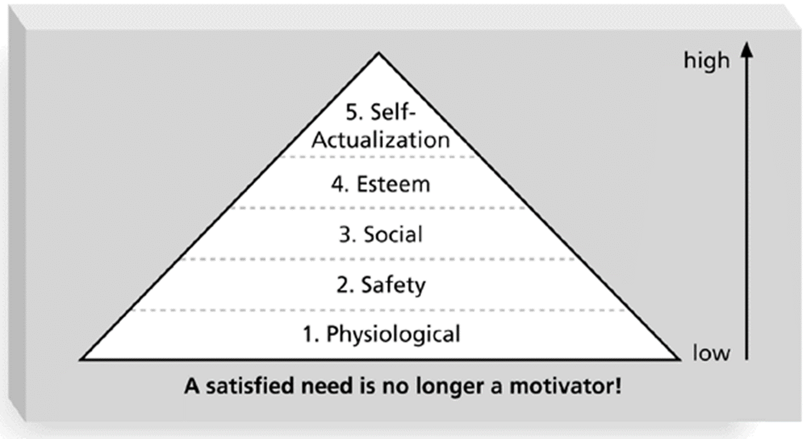
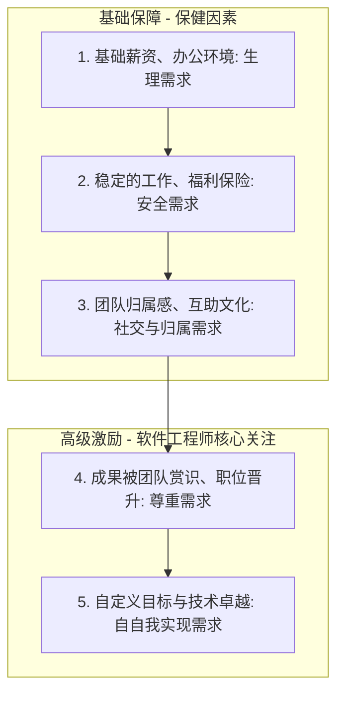
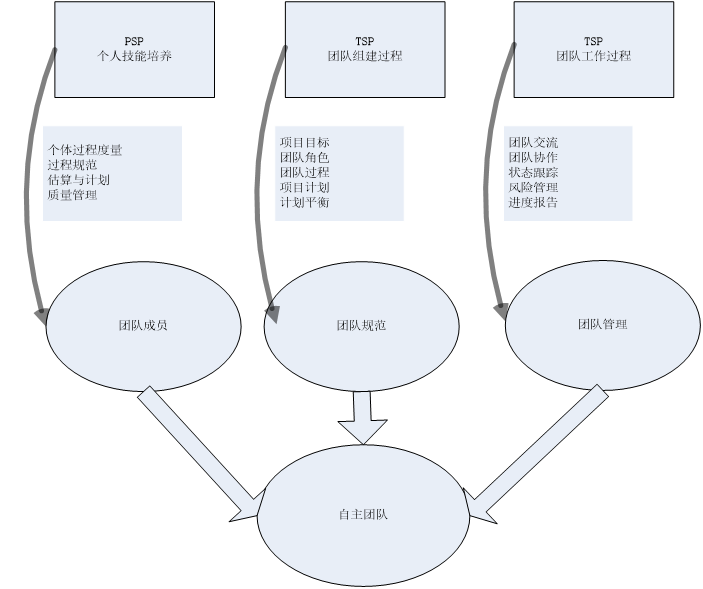
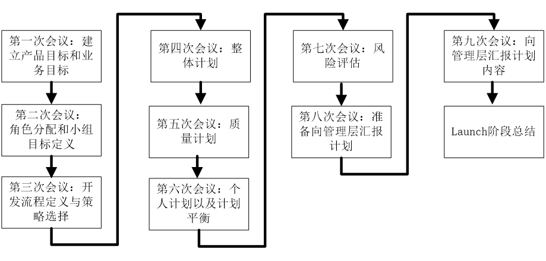
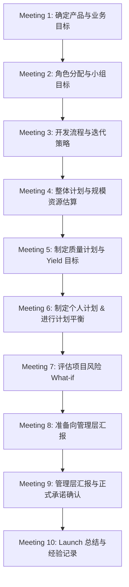
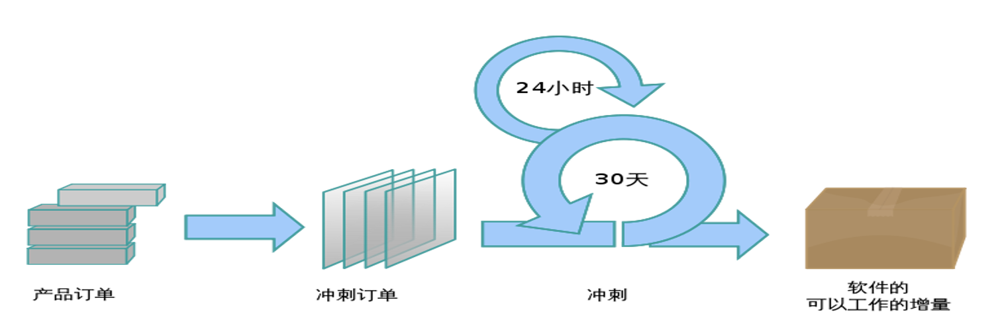

# 第03讲：团队动力学 (PSP, TSP, Scrum)

- [ ] **知识工作管理与胶冻状团队**：理解软件开发作为智力劳动的本质，掌握自组织团队与胶冻状团队的概念。
- [ ] **核心心理学激励理论**：深入掌握马斯洛需求层次、赫兹伯格双因素、麦克格雷格 XY、弗鲁姆期望理论。
- [ ] **领导者与经理的区别**：对比传统经理与团队领导者在沟通、指导、决策和授权方面的本质差异。
- [ ] **承诺文化与特征**：厘清交易型与转变型领导方式，掌握团队承诺的 4 大特征。
- [ ] **TSP 自主团队与 Launch 过程**：熟练掌握 TSP Launch 的 10 次会议流程与计划平衡过程。
- [ ] **TSP 6 大角色经理**：深入掌握 TL、计划、开发、质量、过程、支持经理的目标与职责。
- [ ] **Scrum 与 XP 角色与规范对比**：掌握 Scrum 团队角色及它与 XP 在周期、变更和工程化上的差异。

---

## 🔑 知识工作管理与自组织团队

### 1. 软件开发作为知识工作的本质特征
* **高度抽象与不可重复性**：处理极其抽象的概念，且每次开发的产品都与以往不同（与传统流水线生产有本质差别）。
* **深度沉浸**：知识工作要求全身心投入。依据《人件》，脑力工作者在受到干扰后，通常需要 **30分钟** 才能重新找回状态并全身心投入工作。
* **管理的关键规则**：
  > **“管理者无法管理知识工作者，知识工作者必须实现并学会自我管理。”**

### 2. 知识工作者实现自我管理的前提条件
若要实现成功的自我管理，知识工作者必须：
1. **有积极性**（主观意愿上追求卓越，否则容易被替代）。
2. **能做出准确的估算和计划**。
3. **懂得协商承诺**。
4. **有效跟踪他们的计划**。
5. **持续地按计划交付高质量产物**。

### 3. 胶冻状团队 (Jelled Team)
源自 DeMarco & Lister 的《人件》。团队中蔓延着独特的伦理、态度与力量：
* 成员凭直觉就知道何时以及如何帮助彼此，具有强烈的归属感和互助精神。
* 每一个团队成员都深深感觉到是共同力量的一部分，从而爆发出极高的自主能动性。

---

## 🧠 核心心理学激励理论（考试重点）

### 1. 【2014】马斯洛需求层次理论
人类的需求从低到高分为五个层次（生理需求 $\rightarrow$ 安全感 $\rightarrow$ 爱和归属感 $\rightarrow$ 获得尊敬 $\rightarrow$ 自我实现）。
* **核心规律**：
  * 未满足的需求才是奋斗的动力。
  * 低层次的需求必须在满足高层次需求之前得到部分满足。
  * 满足高层次需求（如自我实现）的途径比满足低层次需求的途径更为广泛。

### 📊 马斯洛需求层次与软件工程师激励对应图

### 2. 赫兹伯格的双因素理论 (Herzberg's Theory)
* **保健因素 (外在因素)**：如工作环境、薪金、工作关系、安全性等。满足这些因素只能“消除不满”，但无法带来“真正的满意和高生产率”。
* **激励因素 (内在因素)**：如成就感、责任感、晋升、被赏识与认可。能够带来真正的满意和内驱力。

### 3. 麦克格雷格的 X 理论 与 Y 理论
* **X 理论**：假定人天生不喜欢工作并设法逃避。只能用马斯洛底层的需求（生理和安全）进行威逼利诱。
* **Y 理论**：假定人在适当激励下能自我约束、自导自控并渴望承担责任。应当用高层需求（自尊和自我实现）进行激励。

### 4. 弗鲁姆的期望理论 (Expectancy Theory)
激励力量由下述公式决定：
$$M = V \times E$$
* **激发力量 (Motivation, M)**：调动一个人积极性、激发内部潜力的强度。
* **目标价值/效价 (Valence, V)**：达到目标对于满足个人需要的价值大小（因人而异，分为正、零、负）。
* **期望值 (Expectancy, E)**：个人根据经验判断达到该目标的可能性大小（概率）。
* 💡 **提高成功把握 (E) 的两种方式**：
  1. **现实扭曲立场**：依靠强烈的个人魅力和精神意志（如乔布斯）。
  2. **可靠的数据**：用详尽的数据与计划支撑，让开发人员相信目标是可以达成的，以此维持高期望值。

---

## 🤝 领导者与经理的区别

知识工作者的管理需要的是**领导者 (Leader)**，而非传统的**经理 (Manager)**。二者在多个维度存在本质区别：

| 维度 | 传统经理 (Manager) | 团队领导者 (Leader) |
| :--- | :--- | :--- |
| **沟通方式** | 告知 (Tell) | 倾听 (Listen) |
| **指导方式** | 指导/命令 (Direct) | 询问/启发 (Ask) |
| **说服策略** | 说服 (Persuade) | 激励与挑战 (Inspire & Challenge) |
| **决策机制** | 决定 (Decide) | 促进达成一致 (Facilitate Consensus) |
| **控制方式** | 控制 (Control) | 教练/辅导 (Coach) |
| **日常监控** | 监控 (Monitor) | 授权/授信 (Delegate) |
| **目标设定** | 设定具体目标 (Set Goals) | 提出挑战方向 (Challenge) |

---

## 👥 承诺文化的建立与团队激励

管理激励团队成员主要有三种方式：**“威逼”、“利诱” 与 “鼓励承诺”**。
* **交易型领导方式**：使用“威逼”与“利诱”的手段。人们往往会设法在少做工作的同时拿到全部奖励，因此很少能产生创新的团队。
* **转变型领导方式**：使用“鼓励承诺”（用成就激励）手段，是知识型团队的首选。

### 1. 团队承诺的条件
当满足以下条件时，**团队承诺**比个人承诺更具凝聚力与激励作用：
* 所有团队成员共同参与并自愿作出承诺；
* 团队依赖于每一位成员履行自己的承诺；
* 承诺具有详尽可行的计划（Data）支撑。

### 2. 软件开发团队承诺的四大特征
1. **自愿的**：不能被强迫接受死线。
2. **公开的**：向整个团队做公开的声明。
3. **可信（行）的**：有客观的历史数据与工作分解支持。
4. **向团队承诺**：对身边的同伴承诺，而非仅仅是对遥不可及的管理层。

### 3. 维持高激励水平的手段
* **及时的绩效反馈**：根据详细计划衡量进度，能在越早的阶段（如在单元测试前进行代码评审）发现并修复缺陷，总体的消除代价就越低，反馈也最强烈。
* **合理的里程碑**：为长期的、富有挑战性的项目提供阶段性反馈，让人更有意愿配合合理的加班。

---

## 👥 TSP 自主团队与 Launch 过程

### 1. 自主团队定义与特征
自主团队由 2 个或更多的人组成，分工明确，协力达成共同目标。其核心特征是：
* 自行定义项目目标；自行分配成员角色；自行决定开发策略与定义开发过程；
* 自行制定项目开发计划；自行度量、管理和控制项目工作。

### 2. 获取管理层支持的策略
* **启动阶段**：
  1. 尽最大可能在计划中满足管理层的期望，并向其证明计划的合理性。
  2. 在计划中明确为了高质量而开展的工作（如评审），并体现合理的项目变更与定期报告机制。
* **进展阶段**：
  1. 严格遵循定义好的开发过程开展工作，并动态维护个人/团队计划。
  2. 实施高成熟度的质量管理：**2级/3级是基于当前已发生的事实被动纠偏**；而 **4级/5级是基于模型预测最终结果来提前纠偏**。

### 3. TSP 对自主团队的支持
TSP 建立在自组织与过程数据的基础上，提供科学的角色划分、规范的平衡机制来辅助团队高效运转：

### 4. TSP Launch 会议 (10次会议/4天完成)
* **主持划分**：第 1 次和第 2 次会议由**项目经理**主持（主要明确期望和目标）。
* **过程设计**：第 3 次会议起，团队开始自定义开发流程，划分迭代周期。
* **正确认识**：软件开发阶段不仅仅是注入缺陷的阶段，测试也绝非唯一的缺陷消除阶段。开发与测试都存在缺陷注入与消除的可能。
* **工期定律**：项目的实际完成时间，由**最晚完成工作的人（Bottleneck 瓶颈）**决定。

### 📊 TSP 10次 Launch 会议流程图

---

## 🛠️ 【2022Fall】【2021Fall】TSP 6大角色经理详解

高成熟度 TSP 团队包含 6 种明确分工的角色经理：

### 1. 项目组长 (Team Leader, TL)
* **目标**：建设和维持高效团队，激励成员，妥善处理成员问题，提供完整项目信息。
* **典型技能**：天生的领导者，能识别问题关键并做出客观决策，敢于扮演“恶人”，尊敬团队成员。
* **工作内容**：主持周例会，每周汇报项目状态，分配任务，组织项目总结（Post-Mortem）。

### 2. 计划经理 (Planning Manager)
* **目标**：开发完整的、准确的团队计划和个人计划，每周准确汇报小组状态。
* **典型技能**：做事极具条理和逻辑性，对过程度量数据感兴趣，愿意追踪和度量工作。
* **工作内容**：带领团队开发项目计划，主导**计划平衡 (Plan Balancing)**，跟踪项目进度，参与总结。

### 3. 开发经理 (Development Manager)
* **目标**：开发优秀的软件产品，充分利用团队成员的技能。
* **典型技能**：喜欢创造，具备深厚的设计功底，熟练使用设计工具，愿意倾听他人的设计思想。
* **工作内容**：带领团队制定开发策略；开展产品规模估算和时间资源估算；主导高层设计与详细设计规格说明；领导实现、集成与系统测试。

### 4. 质量经理 (Quality Manager)
* **目标**：确保团队严格执行质量计划，监督所有评审（Review）正常开展并形成报告。
* **典型技能**：极度关注质量，具备丰富的评审经验，有协调有效评审的能力。
* **工作内容**：制定并跟踪质量计划；发现质量问题时向项目组长警示；在产品提交配置管理前组织并协调评审。

### 5. 过程经理 (Process Manager)
* **目标**：确保全员准确记录、报告和跟踪过程数据，记录所有团队会议纪要。
* **典型技能**：对过程定义、过程度量及持续改进（SPI）有浓厚兴趣。
* **工作内容**：定义和维护开发过程与标准；记录并维护会议记录（Minutes）；协助收集与改进提案（PIP）的提交。

### 6. 支持经理 (Support Manager)
* **目标**：提供合适的开发环境与工具，保证配置管理基线不发生非授权变更，跟踪风险。
* **典型技能**：各类开发和版本控制工具（如 Git、SVN）的专家，熟悉配置管理流程。
* **工作内容**：识别工具需求；主持配置控制委员会（CCB），管理配置系统；维护词汇表与风险跟踪系统，支持复用策略。

---

## 👥 Scrum 与 XP 的角色与规范对比

### 1. Scrum 团队角色
* **产品负责人 (Product Owner, PO)**：代表利益攸关者，负责将开发团队的产出价值最大化，拥有管理和排序 Product Backlog 的唯一权力。
* **开发团队 (Development Team)**：自组织、跨职能。**Scrum 不认可任何团队头衔或子团队（如测试组、架构组）**，所有成员均称为开发人员，责任由整体承担。
* **Scrum Master (SM)**：服务型领导（Servant Leader）。负责扫除团队进展中的障碍，向 PO、开发团队以及组织提供 Scrum 理论及变革支持。

### 2. 💥 💥 Scrum 与 XP 核心差异对比（大题常考）

| 对比维度 | 极限编程 (XP) | Scrum |
| :--- | :--- | :--- |
| **迭代周期长度** | 通常较短，为 **1 ~ 2 周**。 | 相对较长，为 **2 ~ 4 周 (或 1 个月)**。 |
| **迭代中需求变更** | **允许需求变更**。只要变更后的需求与原需求所需的开发时间/资源等价（等价替换原则）。 | **需求冻结**。一旦 Sprint 开始，任何人不得变更 Sprint Backlog，需求被锁死。 |
| **迭代需求优先级** | **必须严格遵守**优先级。按 Product Backlog 降序依次实现。 | **较为灵活**。可以根据依赖关系或技术难度在迭代中微调顺序。 |
| **过程工程化程度** | **极高**。XP 对具体的开发流程和编码行为定义极其严格（如结对编程、TDD、重构等）。 | **未实现工程化**。主要是一个管理框架，只规定会议和管理机制，代码质量由团队自觉保证。 |

---

## ✍️ 练习题

### 思考题
1. 为什么期望理论中强调“使用数据”比单纯的“现实扭曲”对开发人员更具有长期的激励效果？
2. 在 RUP 生命周期的四个阶段中，哪一个阶段主要侧重于“设计并确定系统的体系结构，制定项目计划，确定资源需求”？

#### Q1 在 TSP（团队软件过程）自主团队中，建立“承诺文化（Commitment Culture）”是团队高绩效的关键支撑。根据 TSP 的定义，一个符合规范且有效的“团队承诺”必须具备以下哪些核心特征？
* A. **自主性**：承诺是自愿的，由履行承诺的人自己制定，而不是外部主管强加的
* B. **公开性**：承诺是公开且透明的，需在所有相关利益方 and 团队成员面前公开确认
* C. **可信性**：承诺是基于客观数据与理性分析得出的，而非为了安抚管理层而盲目作出的口头保证
* D. **无条件性**：无论开发过程中发生何种不可抗力（如需求剧烈变化），承诺的交付时间与范围一经做出均不得在后续项目运行中调整
* **正确答案**：ABC
* **解析**：A项、B项、C项正确。根据 TSP 的承诺文化，一个合规的承诺（Commitment）必须满足：(1) 它是自愿的（Voluntary，自己制定的）；(2) 它是公开的（Public，向团队和管理者公开）；(3) 它是可信的（Credible，有 PSP 历史度量数据支撑，并非信口开河）；(4) 它是面向团队的（To the team，对同伴的承诺），且承诺内容会被追踪和维护。D项错误，当项目的前提假设或需求发生重大改变时，合理的做法是基于数据及时启动“重新协商计划/重新平衡计划（Plan Balancing）”以调整承诺，盲目的“无条件坚守”违背了 TSP 基于数据的科学控制原则。

#### Q2 某项目组正在制定新版管理系统的迭代计划。项目经理张工运用弗鲁姆（Vroom）的期望理论（$M = V 	imes E$）来激发开发人员小李的积极性。已知该任务完成后将发放全额项目奖金，这属于高激励值（效价 $V$ 很大）。然而，小李对于按时交付感到非常焦虑，认为由于技术难点多且无历史估算经验，自己按时完成的概率极低（期望值 $E$ 趋近于零），导致其综合工作动力（$M$）并不高。作为计划经理，下列哪项操作是通过“提高期望值 $E$”来最有效提升小李工作积极性的手段？
* A. 将项目奖金的总额再提升 50%，以期用更诱人的回报消除他的焦虑
* B. 采用 TSP 中的 WBS 任务分解，将任务细化到以小时为单位，并根据小李的 PSP 历史生产率协助他做细化估算，并在必要时开展计划平衡（Plan Balancing）以确保任务在能力范围内
* C. 对小李进行“现实扭曲”式的心灵鸡汤式动员，承诺只要他加班加点，公司绝对不会亏待他，但不对项目计划做任何调整
* D. 安排一名资深工程师直接接手该任务，将小李边缘化，使其只负责简单的文档撰写工作
* **正确答案**：B
* **解析**：弗鲁姆期望理论中，$M = V 	imes E$。A项错误，提高奖金金额是在提高效价 $V$，而非期望值 $E$，如果员工认为成功的概率（$E$）为零，即使把奖金提得再高，乘积 $M$ 依旧接近零，无法产生动力。B项正确，通过 WBS 任务细化和 PSP 历史数据估算，将看似不可能的“大任务”变成可以度量、可以掌控、逐步完成的“小任务”，同时利用 Plan Balancing 调整负荷，极大地增强了员工“付出努力便能达成目标”的信心，从而将期望值 $E$ 从零提升到合理水平，这是典型的基于数据科学管理提升期望值的方法。C项错误，属于情感绑架，没有实际解决开发人员对成功概率的科学评估。D项错误，是放弃培养和合理分工。

#### Q3 在 TSP 自主团队的 6 种经理角色中，不同的角色有着明确的职责划分与协同。以下关于各角色职责的描述以及它们之间的联动关系，正确的是（ ）。
* A. **质量经理**主要职责是带领团队开发项目计划并负责计划平衡；一旦发现项目进度落后，需向**开发经理**警示
* B. **过程经理**不仅负责定义与维护开发过程标准，还负责在产品提交配置管理前组织协调所有的同行评审
* C. **支持经理**负责主持配置控制委员会（CCB），管理配置系统，并维护项目风险和问题跟踪系统；而**计划经理**则主导**计划平衡（Plan Balancing）**
* D. **开发经理**的核心目标是确保团队严格执行质量计划，监督所有评审（Review）正常开展并形成报告
* **正确答案**：C
* **解析**：A项错误，带领团队开发项目计划并负责计划平衡是计划经理的职责；发现进度落后警示的是计划经理，而质量经理是在发现质量问题（如缺陷率超标、未按标准执行评审）时向项目组长警示。B项错误，定义与维护开发过程标准是过程经理的职责，但“组织协调所有的同行评审”是质量经理的职责。C项正确，主持配置控制委员会（CCB）、管理配置系统及维护风险是支持经理的职责，主导计划平衡是计划经理的职责。D项错误，确保团队执行质量计划并监督评审是质量经理的职责，开发经理的目标是主导设计与技术策略的制定与开发实现。

#### Q4 【2023真题】对比TSP和SCRUM，下列说法不恰当的是：
* A. 都是过程框架，需要填补具体实践之后才是一个可以工作的过程
* B. 一种是计划驱动方法，另外一种是敏捷方法
* C. SCRUM适合迭代式场景，TSP适合瀑布场景
* D. 两种方法都需要进行度量数据收集、分析，从而支持管理决策
* **正确答案**：B, C
* **解析**：
  * B 不恰当：在课程体系中，Scrum 和 TSP 均强调自律与计划管理，两者并不绝对对立，而是融合的。
  * C 不恰当：TSP 也采用多次 Cycle 迭代，并不只适用于瀑布场景。

#### Q5 【2023真题】以下特征适用麦克勒格Y理论（McGregors Theory Y）激励的场合是：
* A. 关注工作环境，薪金等
* B. 更喜欢经常的指导，避免承担责任，缺乏主动性
* C. 自我中心，对组织需求反应淡漠，反对变革
* D. 能够自我约束，自我导向与控制，渴望承担责任
* **正确答案**：D
* **解析**：Y理论假设员工能自我约束和自我导向，渴望承担责任。

#### Q6 【2023真题】以下关于马斯洛的需求层次理论描述不正确的是：
* A. 自我实现是寻求自尊（Esteem）
* B. 激励来自为没有满足的需求而努力奋斗
* C. 低层次的需求必须在高层次需求满足之前得到满足
* D. 满足高层次的需求的途径比满足低层次的途径更少
* **正确答案**：A, D
* **解析**：自我实现是最高级（第五级），自尊是第四级；高层次需求满足的途径比低层次更多元。

#### Q7 【2023真题】以下关于团队动力学的论述，不恰当的是：
* A. 马斯洛的需求层次理论可以用来更好地维持激励水平
* B. 智力工作的激励方式中，应该尽可能使用鼓励承诺这种方式
* C. 麦克勒格的X理论适合用马斯洛底层需求激励
* D. 海兹伯格的激励理论区分为内在因素和外在因素两种
* **正确答案**：A
* **解析**：马斯洛理论解释了需求层级，但在“维持”激励水平上，赫兹伯格的双因素理论（保健因素用于消除不满、维持水平）更具有针对性。

#### Q8 [主观题] 【2023真题】结合“软件开发作为一种知识工作，需要领导者而不是一般的经理”，阐述知识工作领导者应该具备的品质或者特点（至少三项）。
* **参考答案**：
  德鲁克和 Humphrey 指出，知识工作领导者应具备以下特点：
  1. **建立共同愿景与挑战目标**：以愿景和价值凝聚独立的知识工作者，而非强力行政命令。
  2. **授权团队进行自主管理与决策**：授权自主团队（如 TSP 启动会议中）自我规划、分配任务与制定策略，领导者主要提供资源保障。
  3. **建立安全、信任和承诺的氛围**：建立不惩罚报缺陷的安全开发文化，鼓励员工基于 PSP 历史数据做出个人承诺。

#### Q9 [主观题] 【2023真题】敏捷宣言有哪些内容？我们该如何正确理解敏捷宣言？
* **参考答案**：
  1. **四大核心价值观**：个体和互动高于过程和工具；工作的软件高于详尽的文档；客户合作高于合同谈判；响应变化高于遵循计划。
  2. **正确理解**：
     * **“高于”不等于“抛弃”**：敏捷并非抛弃计划、文档和规范，而是当冲突时更看重前者。例如必要的架构设计文档和自动化测试工具在敏捷中仍必不可缺。
     * **以价值交付为进度度量**：能给客户带来价值的工作软件才是进度唯一的真实度量。
     * **人是主体，提升沟通带宽**：提倡直接面对面交流，减少流程限制。
