# 第04讲：软件估算、计划与跟踪 (PROBE, EVM)

- [ ] **软件估算事实与原则**：理解估算目的，掌握估算四大核心原则。
- [ ] **PROBE 估算方法**：掌握基于代理估算（PROBE）的概念、工作流及相对大小矩阵。
- [ ] **历史度量数据三种算法**：熟练掌握线性回归（Method A）、乘数法（Method B）与平均值/中位数法（Method C）的计算。
- [ ] **WBS 检查与计划编制**：理解工作分解结构（WBS）检查表，掌握计划编制中“工期”与“任务时间”区别。
- [ ] **挣值管理 (EVM) 计算**：熟练进行 PV、EV、AC、SV、CV、SPI、CPI 以及完工预测（EAC, ETC）的计算大题。
- [ ] **项目总结与检查**：掌握 Post-Mortem 流程，了解 TSP 角色经理在项目总结中的自查标准。

---

## 🔑 软件估算的基本原理与 PROBE 方法

### 1. 【2013】【2015A】【2018Fall】关于估算的基本事实
* **估算目的**：为各项计划提供科学的决策依据，而不是给出一个绝对精确的预测值。
* **估算事实**：
  * 估算本质上是客观猜测，估算能力很难单纯靠直觉提升。
  * 没有任何人能事先知道百分之百准确的数字。
  * 实证研究表明：是否使用复杂的估算模型（如 COCOMO），在最终偏差上并无显著差异。
* **估算要点（四大原则）**（**【2022Fall】考点**）：
  1. **划分尽可能详细（分而治之）**：将任务划分为多个独立的、小规模的部件，估算误差倾向于相互抵消。
  2. **建立对结果的信心**：由开发人员自行估算，保证承诺自愿。
  3. **依赖数据**：使用个人的历史度量数据，排除主观偏见。
  4. **重在达成共识的过程，而非结果**：估算的过程是相关干系人达成共识并相互对齐的过程。

### 2. PSP 与 PROBE 估算方法
* **规模估算的困境**：以 LOC (代码行) 和 FP (功能点) 为例：
  * 精确的度量方式（如LOC）往往不便于在项目早期规划时使用。
  * 便于早期规划的度量（如产品功能）往往难以产生精确的度量结果。
* **PROBE（Proxy-Based Estimation，基于代理的估算）**：
  * **定义**：利用“代理 (Proxy)”作为精确度量和早期规划之间的桥梁。
  * **住宅建造成本类比**：在早期规划中，不直接估算砖瓦数或具体建造成本，而是识别代理元素（如：1个中等厨房、3个小卧室、1个大客厅），然后通过历史数据库计算这些代理的规模和成本。

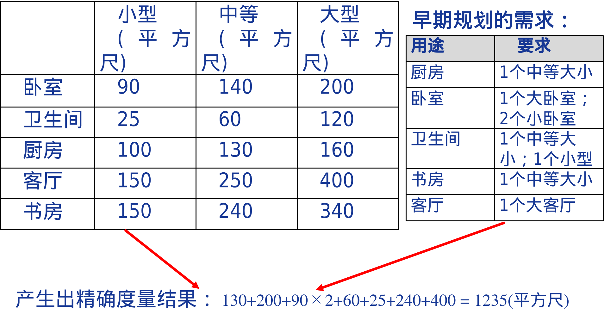

#### PROBE 估算流程
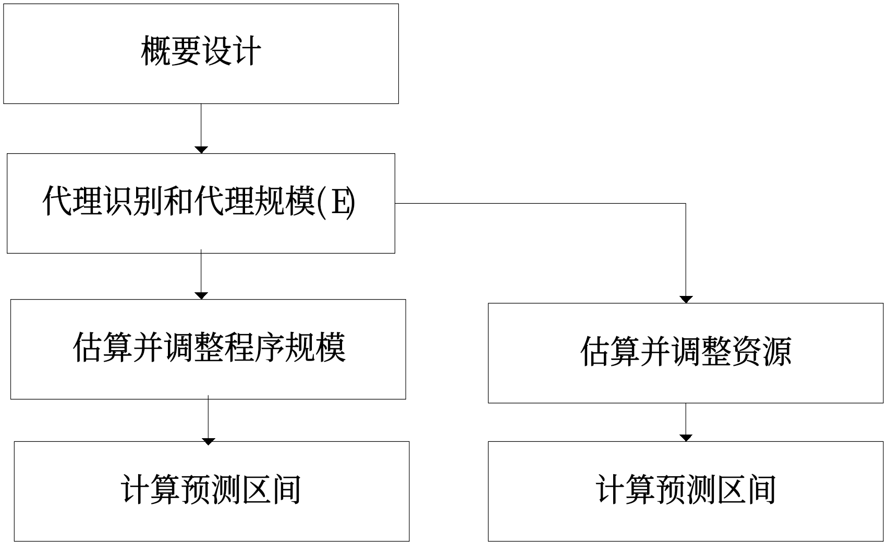

* **流程说明**：
  1. 做出概要设计，明确所需组件。
  2. 使用“**代理 (Proxy)**”将组件类别与大小与历史数据库进行比对，选择相对大小。
  3. 查取历史数据库得到基准 LOC，最后通过线性回归和预测区间给出预测值。

#### PROBE 概要设计 (Conceptual Design)
* 估算的第一步是做出概要设计（非真实设计，仅为了识别组件与历史对比）。
* **时间限制**：对于 1000 LOC 以内的程序，概要设计时间应限制在 **10 ~ 20 分钟** 内。

#### PROBE 数学调整与线性回归
线性相关性好（相关系数 $r \ge 0.7$，显著性 $p \le 0.05$）时，严禁直接使用“生产效率（Size/Time）”作分母进行计算。
* **原因**：Plan Size 和生产效率都在一定范围内波动，两数相除会导致误差呈几何级数放大（违背误差抵消原则）。
* **正确做法**：采用两次线性回归进行双重调整：
  1. **规模调整**：依据 Proxy 规模预测计划规模：
     $$\text{Plan Size} = \beta_0 + \beta_1 \times \text{Proxy Size}$$
  2. **时间调整**：依据计划规模预测计划开发时间：
     $$\text{Plan Time} = \gamma_0 + \gamma_1 \times \text{Plan Size}$$

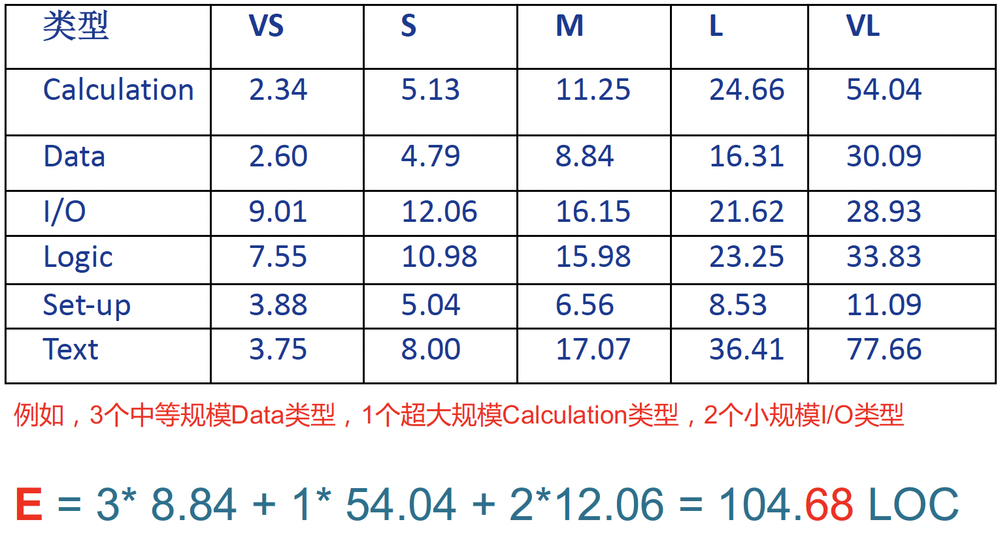
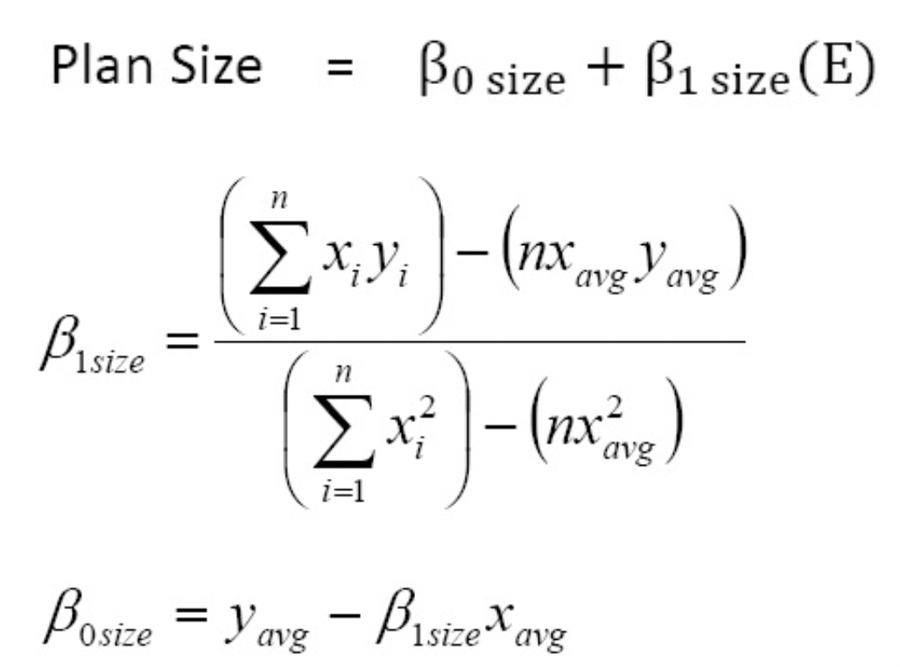
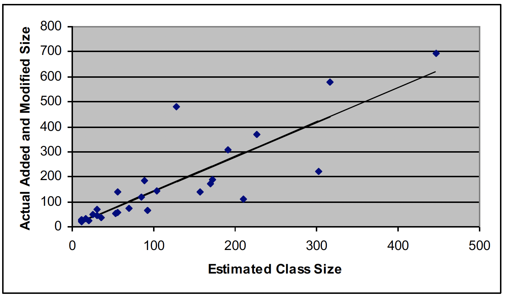
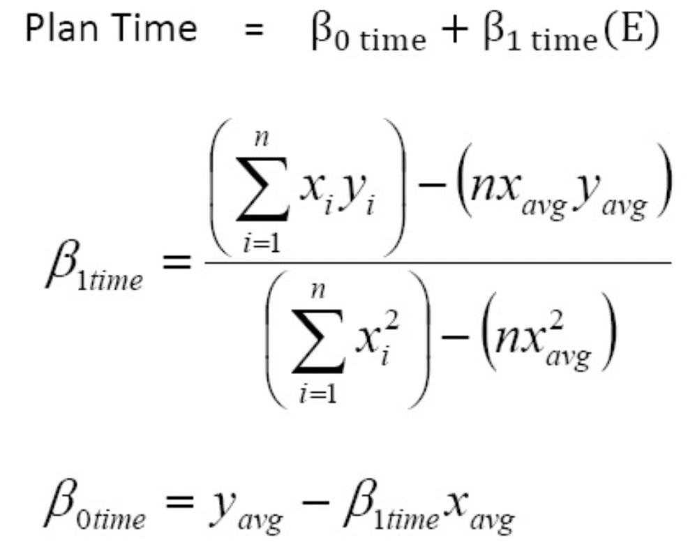

* **估算能力的判定标准**：估算能力的强弱取决于数据点**距离回归线的稳定程度（多稳定）**，而不是单次预测值距离实际值的绝对接近程度。
* **多部件整合**：总时间等于各部分时间相加；总预测区间（Prediction Interval）等于**个人范围（标准差）的平方和，再计算平方根**。

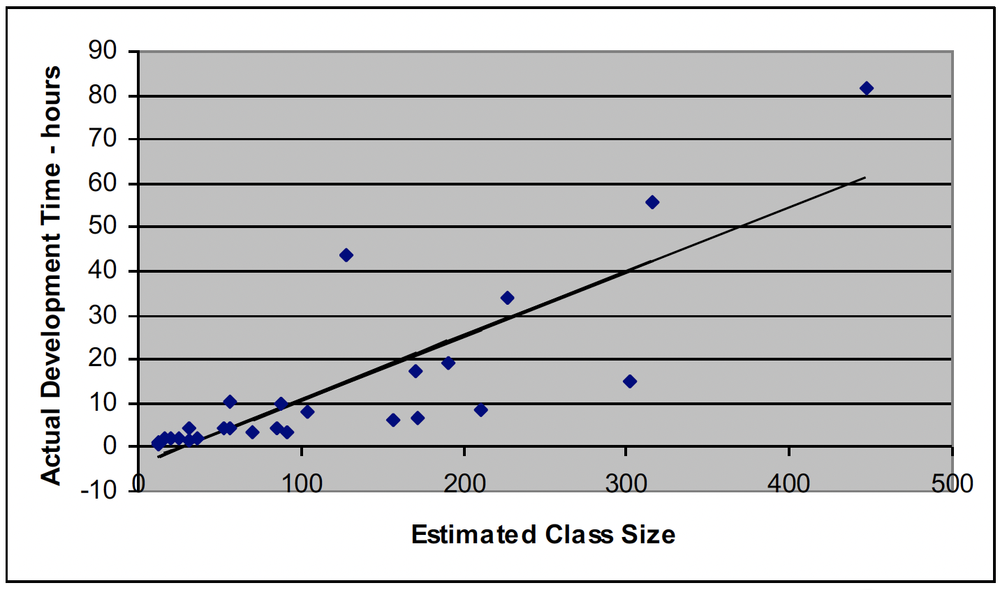
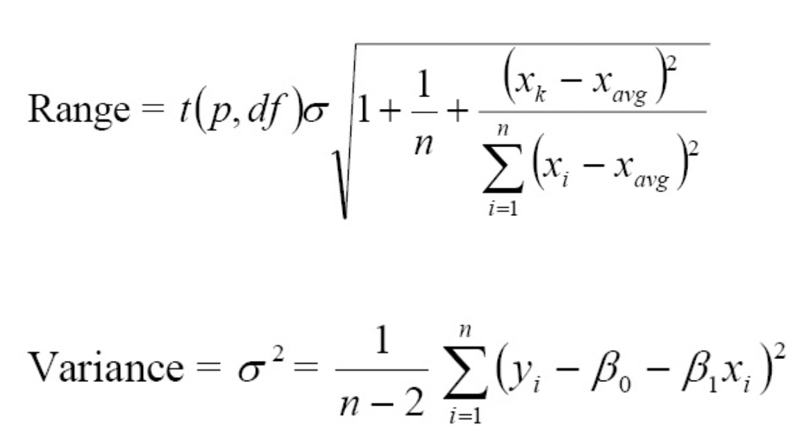

---

## 📅 历史数据的获取与处理算法

度量体现了决策者对试图实现目标的关切程度。PSP的核心度量项包括：**规模、时间、缺陷**。

### 1. 度量日志规范

#### ⏳ 个人时间日志 (Time Log)
必须精确到分钟，用于计算“净工作时间”：

| 序号 | 所属阶段 | 开始时间 | 结束时间 | 中断时间 (Min) | 净时间 (Min) | 备注信息 |
| :---: | :---: | :---: | :---: | :---: | :---: | :--- |
| 1 | 概要设计 | 09:00 | 09:30 | 5 (接电话) | 25 | 记录系统划分 |
| 2 | 详细设计 | 09:30 | 10:15 | 0 | 45 | 绘制UML图 |

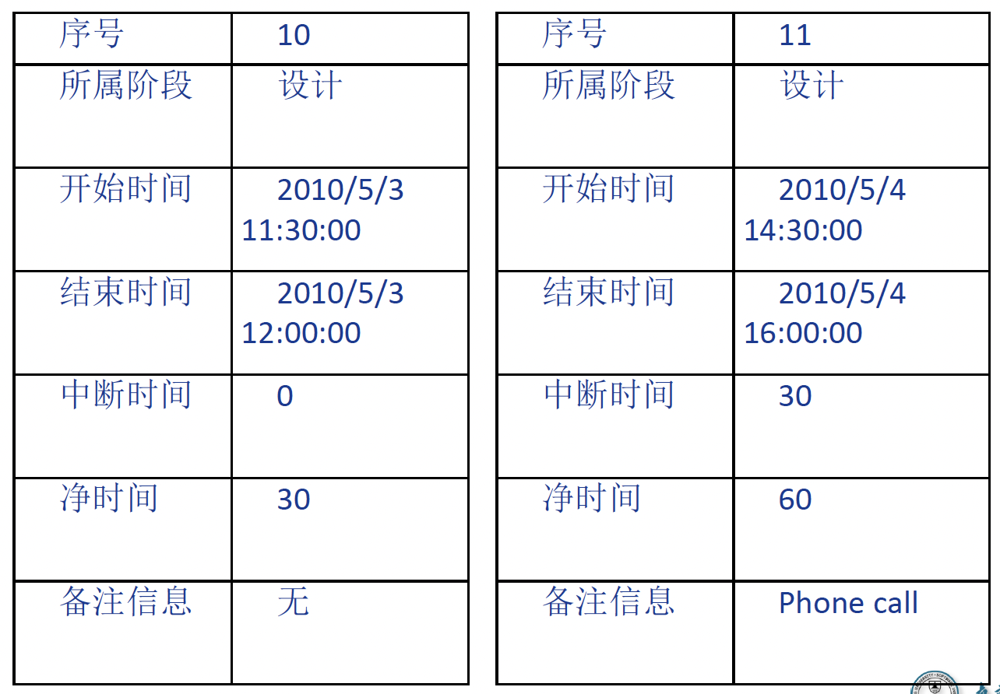

#### 🐛 个人缺陷日志 (Defect Log)
用于详细记录缺陷的生命周期：

| 序号 | 缺陷引入阶段 | 缺陷消除阶段 | 修复时间 (Min) | 缺陷类型 | 缺陷描述 |
| :---: | :---: | :---: | :---: | :---: | :--- |
| 1 | 编码 (Code) | 编译 (Compile) | 3 | 语法错误 | 遗漏分号 |
| 2 | 设计 (Design) | 单元测试 (UT) | 15 | 逻辑错误 | 边界条件判定错误 |

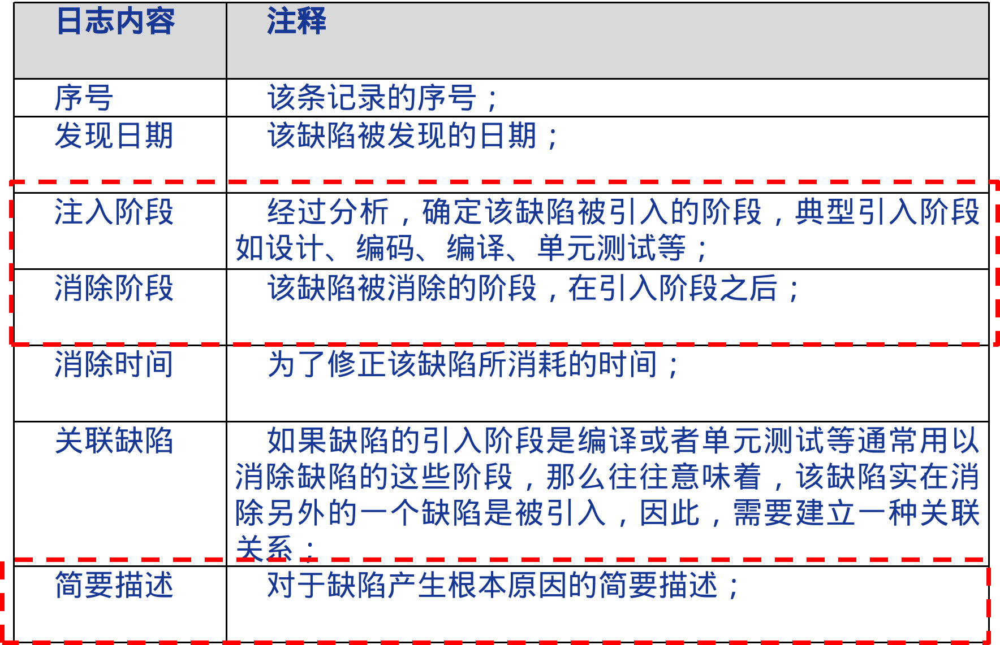

### 2. 相对大小矩阵的历史数据计算方法（三种算法对比）
假设某工程师收集了写过的 10 个历史程序的函数 LOC 数据，需划分相对大小级别。
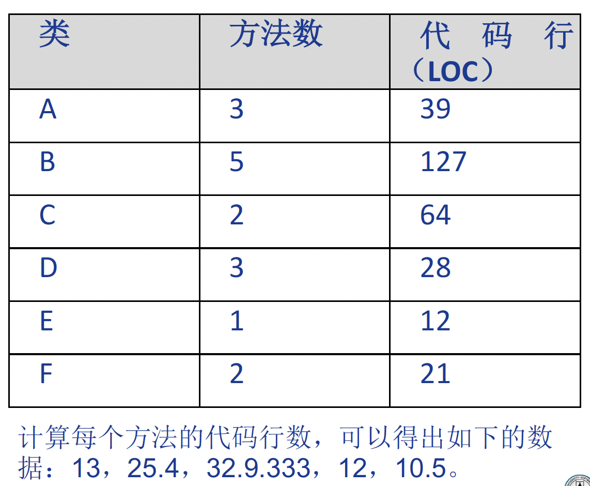
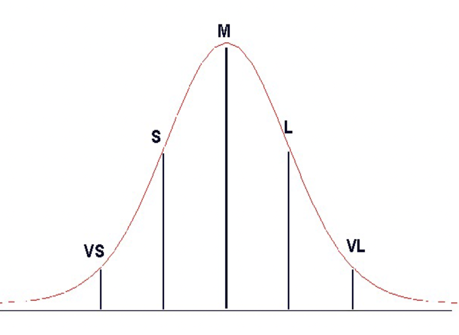

#### 算法一：简单方法
* **计算步骤**：将历史数据从小到大排序。
  * 最小值作为 **Very Small (VS)**；最大值作为 **Very Large (VL)**；中间值作为 **Medium (M)**。
  * VS 与 M 的均值作为 **Small (S)**；VL 与 M 的均值作为 **Large (L)**。
* **评价**：计算极其简单，但极易受到极端值波动的影响，**非常不稳定**。

#### 算法二：正态分布法
* **计算步骤**：计算所有数据的均值 $M$ 和标准差 $\sigma$：
  * $$S = M - \sigma, \quad VS = M - 2\sigma$$
  * $$L = M + \sigma, \quad VL = M + 2\sigma$$
* **评价**：相对稳定，但在历史数据偏斜较大时，容易算出**负数**规模（如 $VS = -1.67$），不合常理。

#### 算法三：对数正态分布法
* **计算步骤**：
  1. 计算所有数据的自然对数：$z_i = \ln(LOC_i)$。
  2. 计算 $z$ 值的均值 $M_z$ 和标准差 $\sigma_z$。
  3. 计算对数下的级别值：
     $$S_z = M_z - \sigma_z, \quad VS_z = M_z - 2\sigma_z$$
     $$L_z = M_z + \sigma_z, \quad VL_z = M_z + 2\sigma_z$$
  4. 计算反对数还原（取以 $e$ 为底的指数）：
     $$VS = e^{VS_z}, \quad S = e^{S_z}, \quad M = e^{M_z}, \quad L = e^{L_z}, \quad VL = e^{VL_z}$$
* **评价**：**最符合人们开发程序的直观感觉**。因为大部分人倾向于写大量规模较小的程序和少量规模极大的程序，且规模绝不会出现负数。

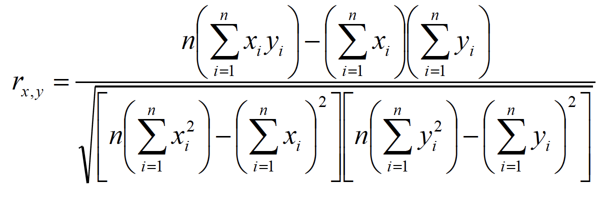

### 3. PROBE 级别使用条件 (A, B, C, D 方法)
根据个人历史数据的完备程度，使用不同的估算等级：
* 历史数据极少或数据质量低时，采用 **D 方法**（根据经验直觉估算）。
* **使用 1 次 D 方法**后，可升格为 **C 方法**（使用相对大小矩阵估算规模，通过平均生产率转换时间）。
* **使用 3 次 C 方法**且数据相关性好后，可升格为 **B 方法**（使用相对大小矩阵预测规模，通过线性回归计算时间）。
* 历史数据完全成熟后，采用 **A 方法**（规模和时间均进行双重线性回归预测）。

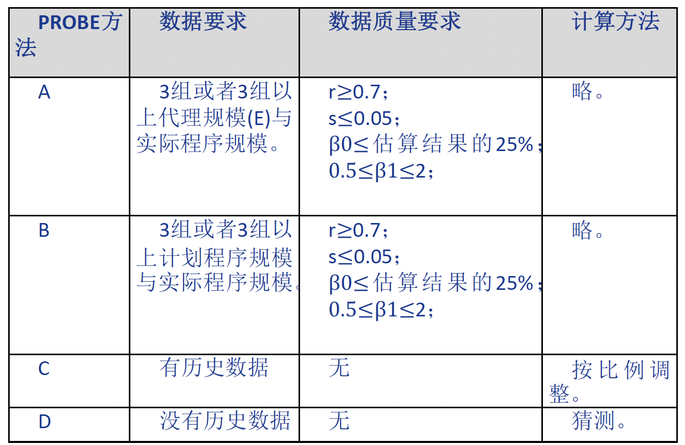
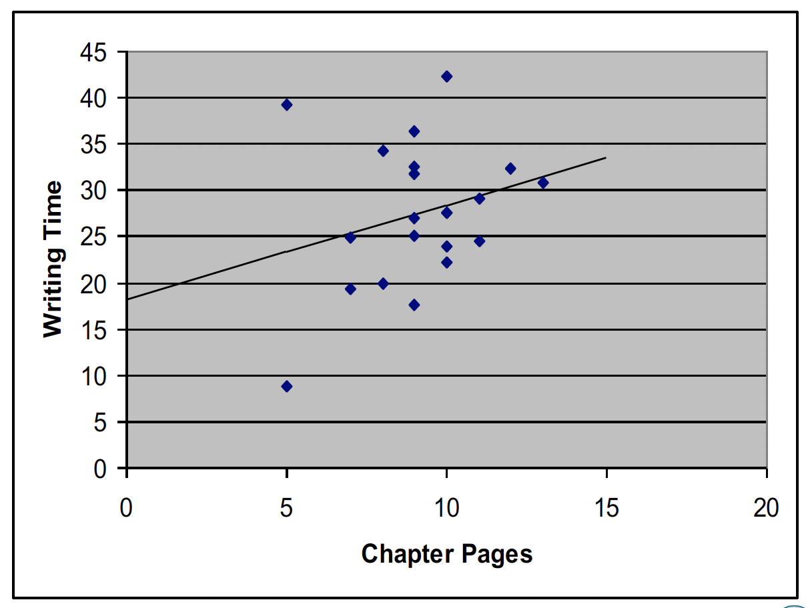
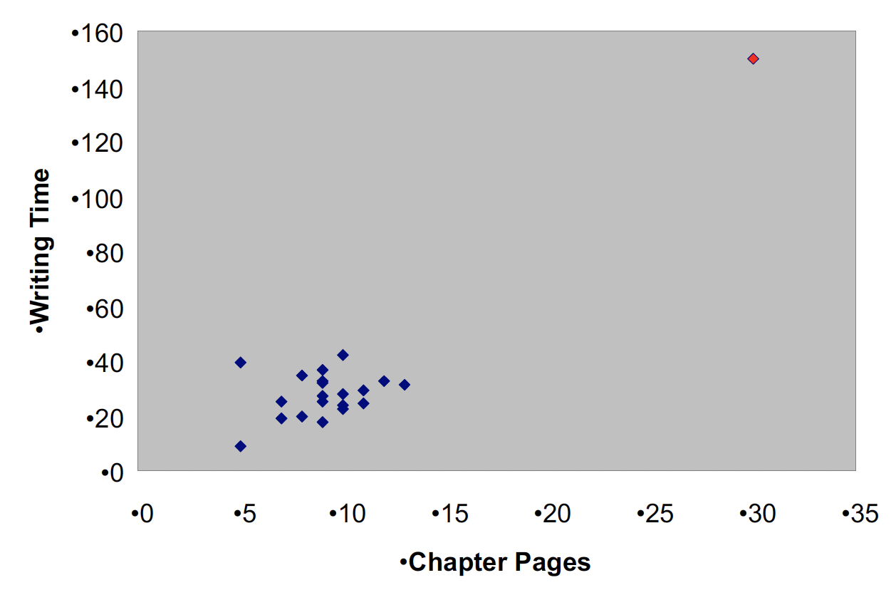

---

## 🛠️ WBS (工作分解结构) 规范

WBS 是项目计划与范围管理的基础。
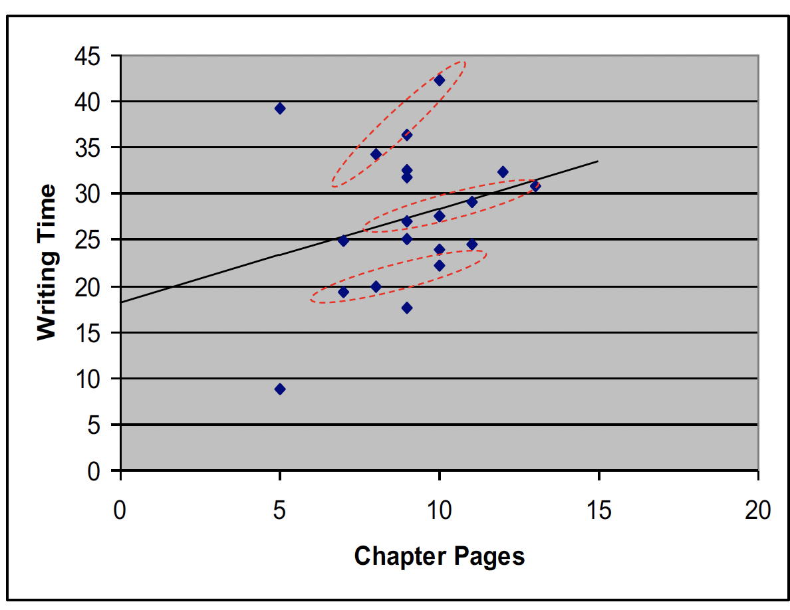
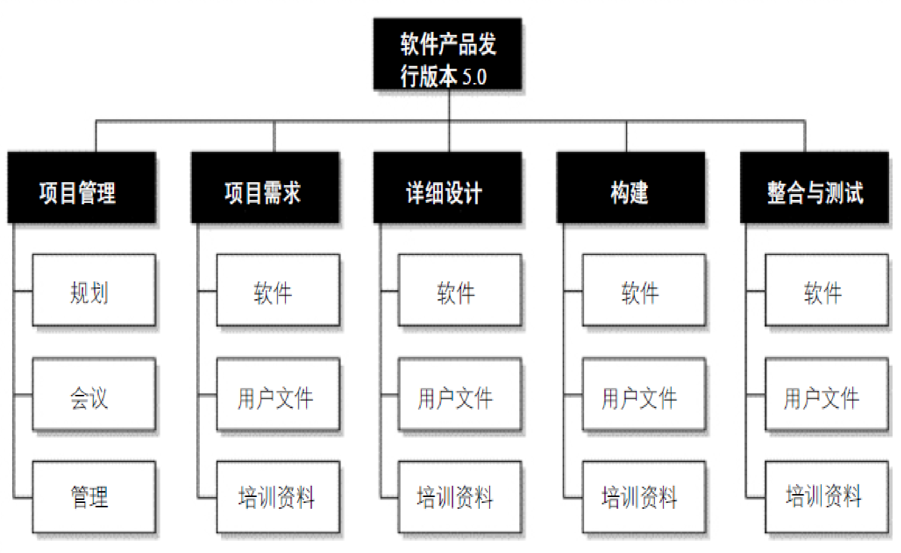

* **优秀的 WBS 检查标准**（**MECE 原则**）：
  1. **最底层要素（工作包）不能重复**：有且仅在 WBS 的一个地方出现。
  2. **所有要素必须清晰定义**：配套的“**数据词典 (Data Dictionary)**”必须清晰完整。
  3. **最底层要素必须有唯一的责任人**：便于进度考核与成本追踪。
  4. **充分必要条件**：最底层的要素是实现项目整体范围的充分必要条件（不漏项，不超范围）。

### 开发策略与计划
开发策略是在需求分析基础之上，明确每个产品组件的获得方式与开发顺序（如瀑布、迭代、增量等生命周期模型选择）：
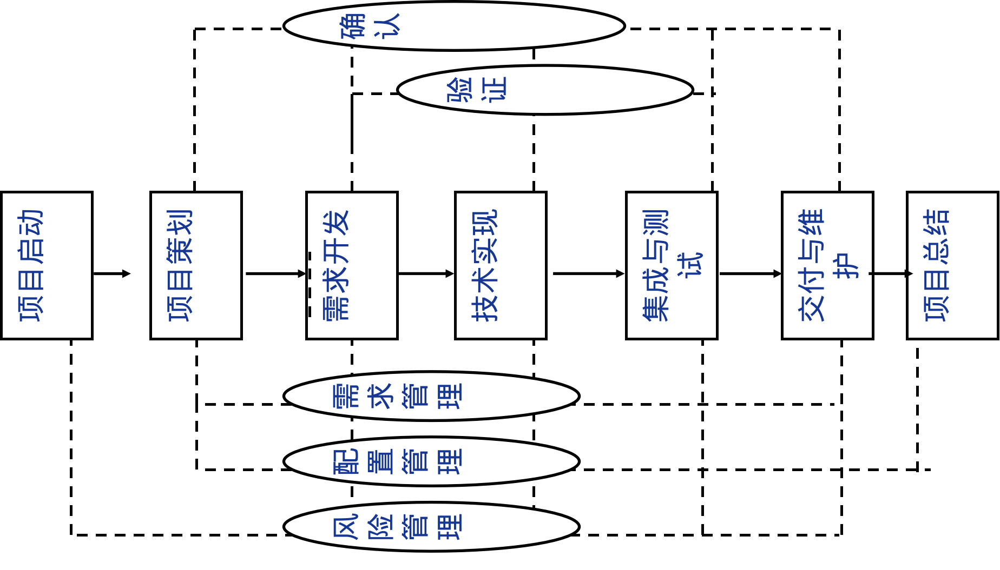

### 通用计划框架
在定义需求、做出概要设计并确定开发策略后，进入通用计划框架（包括规模估算、资源估算和日程计划），其中需求定义、概要设计和日程计划必须人工干预：
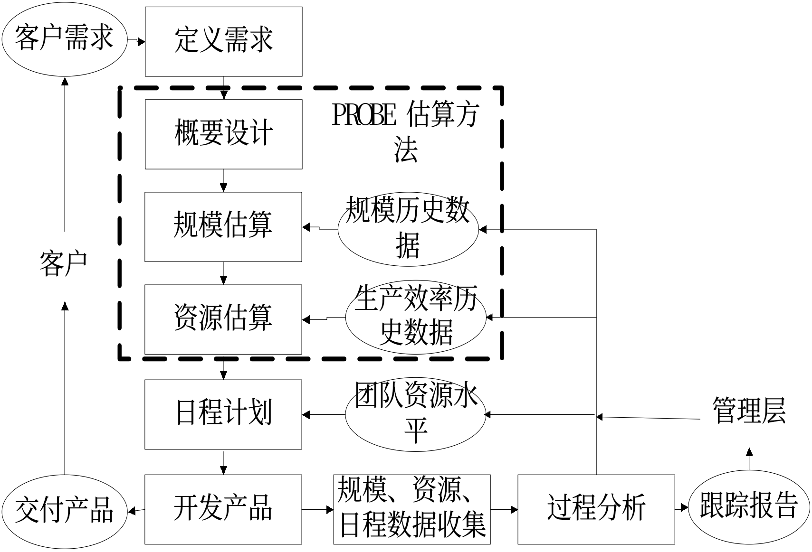

---

## 📐 挣值管理 (EVM) 计算与实战分析（大题必考）

项目的挣值管理（EVM）是通过将“工作量”转化为“货币”或“工时”来定量度量进度与成本的方法。在软件项目中，**计划投入时间（工时）**是最合适的 PV 载体。

### 1. 【2022Fall】EVM 的三种实现级别

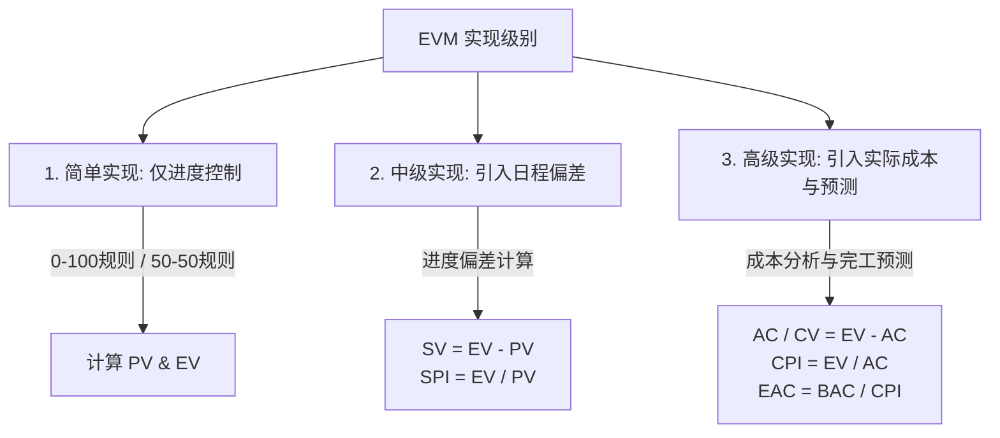
```mermaid
graph TD
    EVM[EVM 实现级别] --> L1[1. 简单实现: 仅进度控制]
    EVM --> L2[2. 中级实现: 引入日程偏差]
    EVM --> L3[3. 高级实现: 引入实际成本与预测]
    
    L1 -->|0-100规则 / 50-50规则| V1[计算 PV & EV]
    L2 -->|进度偏差计算| V2[SV = EV - PV <br> SPI = EV / PV]
    L3 -->|成本分析与完工预测| V3[AC / CV = EV - AC <br> CPI = EV / AC <br> EAC = BAC / CPI]
```

* **简单实现**：仅关注进度，只计算 **PV** 和 **EV**，不考察实际消耗成本。
  * **0-100 规则**：任务只有 100% 完成时，才将 PV 价值全额计入 EV；只要没做完，EV 即为 0。
  * **50-50 规则**：任务一旦宣称启动，即可获得 50% 价值的 EV；当 100% 结束时，再把剩下的 50% 计入 EV。
* **中级实现**：在进度基础上计算进度指标：
  * 日程偏差：$$SV = EV - PV$$
  * 进度绩效指数：$$SPI = \frac{EV}{PV}$$
* **高级实现**：引入实际消耗的成本/工时 **AC**，计算成本偏差及完工预测：
  * 成本偏差：$$CV = EV - AC$$
  * 成本绩效指数：$$CPI = \frac{EV}{AC}$$
  * 完工估算成本：$$EAC = AC + \frac{BAC - EV}{CPI} = \frac{BAC}{CPI}$$

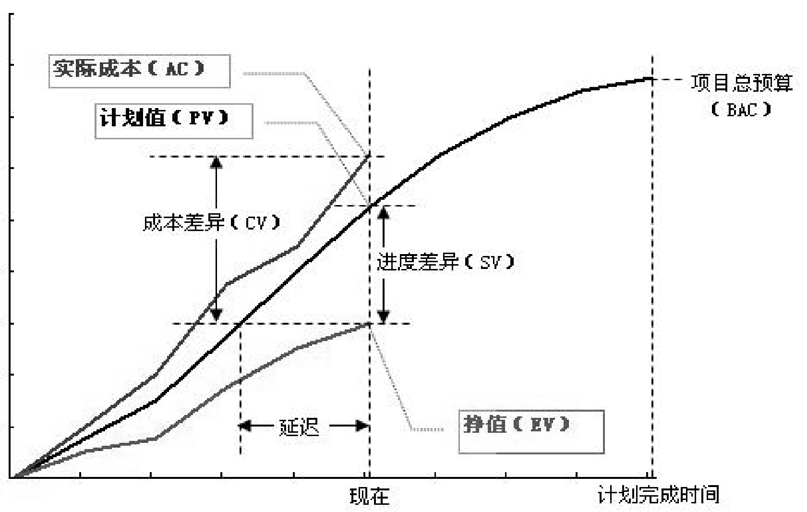
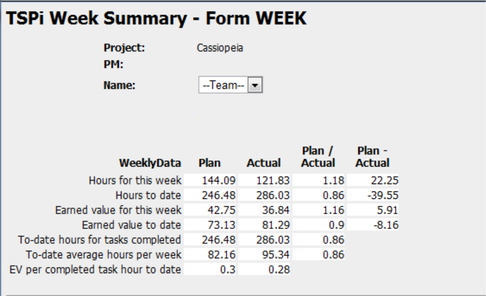
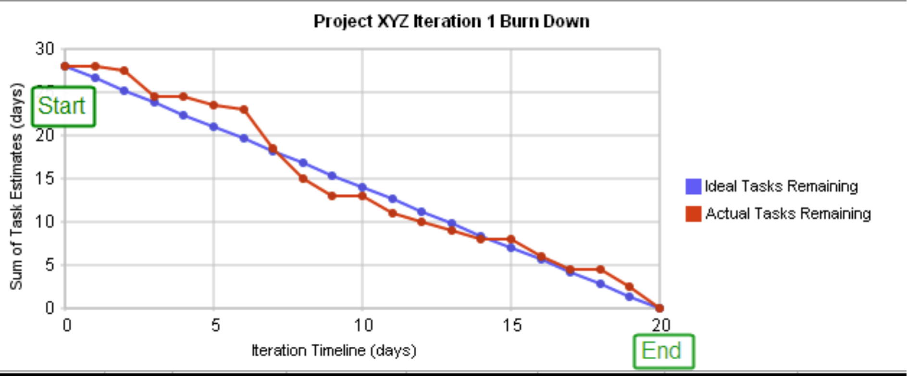

* **EVM 局限性**：EVM 无法应用于质量管理；完全依赖早期估算的准确性；不适用于探索性与轻量敏捷项目。

---

## 📐 挣值管理大题实战演练

**【真题背景】**
某软件开发项目总计划价值为 **$BAC = 100 \text{ 人天}$**，原计划为期 5 天，每天计划完成进度曲线为：第1天 $20 \text{人天}$，第2天 $20 \text{人天}$，第3天 $20 \text{人天}$，第4天 $20 \text{人天}$，第5天 $20 \text{人天}$。
在第3天结束时，项目状态收集如下：
1. 任务 A（PV = 30）已全部完成，AC 实际消耗了 40 人天。
2. 任务 B（PV = 30）已全部完成，AC 实际消耗了 20 人天。
3. 任务 C（PV = 40）刚刚启动，按 50-50 规则折算进度，实际消耗 AC 为 10 人天。

**【请计算并回答】**
1. 第3天结束时的 **PV、EV、AC** 各是多少？
2. 当前项目的 **SV、CV、SPI、CPI** 各是多少？并说明项目的当前进度与成本状态。
3. 按照当前的绩效，预测项目最终完工需要消耗的实际总工时（EAC）。

**【参考解答】**
1. **基本量计算**：
   * 计划在第3天结束时，按天分配计划应完成 $20 \times 3 = 60 \text{ 人天}$。故：$$PV = 60 \text{ 人天}$$
   * 实际完成的任务折算价值（EV）：
     * 任务 A 已完工：$$EV_A = 30$$
     * 任务 B 已完工：$$EV_B = 30$$
     * 任务 C 已启动但未完工，按 50-50 规则：$$EV_C = 40 \times 50\% = 20$$
     * 累计挣值：$$EV = EV_A + EV_B + EV_C = 30 + 30 + 20 = 80 \text{ 人天}$$
   * 实际消耗工时（AC）：
     * $$AC = AC_A + AC_B + AC_C = 40 + 20 + 10 = 70 \text{ 人天}$$

2. **偏差与指标计算**：
   * 日程偏差：$$SV = EV - PV = 80 - 60 = 20 \text{ 人天} \quad (SV > 0，\text{进度超前})$$
   * 成本偏差：$$CV = EV - AC = 80 - 70 = 10 \text{ 人天} \quad (CV > 0，\text{成本节约})$$
   * 进度绩效指数：$$SPI = \frac{EV}{PV} = \frac{80}{60} \approx 1.33 \quad (SPI > 1，\text{进度超前})$$
   * 成本绩效指数：$$CPI = \frac{EV}{AC} = \frac{80}{70} \approx 1.14 \quad (CPI > 1，\text{成本节约})$$

3. **预测完工总工时**：
   * 完工估算：$$EAC = \frac{BAC}{CPI} = \frac{100}{1.14} \approx 87.72 \text{ 人天}$$
   * 预测最终完工需消耗约 **$87.72$** 人天，低于原预算 $100$ 人天。

---

## 🔄 项目总结 (Post-Mortem) 与角色自查问卷

所谓的愚蠢（Insanity），就是**“反复做同样的事情，但是期望有不同的结果”**。项目总结提供了系统化持续改进的途径。

### 1. 基于 PMBOK 的 9 大领域总结核心问题
* **范围管理**：是否有未被识别的需求？是否出现需求蔓延？
* **时间管理**：估算偏差多大？里程碑变更原因？
* **成本管理**：计划工时与实际工时偏差多大？
* **质量管理**：整体质量如何？验收测试缺陷率是多少？
* **人力资源管理**：团队及个人的生产效率如何？满意度如何？

### 2. TSP 总结下 6 大角色经理的自查问卷细则

#### 👑 项目组长 (Team Leader) 自查
* 项目组长的领导力是否有效建设和维持了高效团队？
* 团队成员的工作积极性是否被充分调动？承诺是否存在被迫情况？
* 周例会的效率如何？议程组织、讨论技巧有哪些改进空间？

#### 📊 计划经理 (Planning Manager) 自查
* 产品的规模估算（LOC/Proxy）实际偏差是多少？原因何在？
* 计划开发时间与实际开发时间偏差原因何在？
* 团队的 PV 与 EV 偏离曲线是否合理？进度跟踪机制是否灵敏？
* 对比历史周期，团队整体生产效率是否提升？

#### 💻 开发经理 (Development Manager) 自查
* 实际交付的内容是否完全覆盖了最初的需求？
* 事先制定的开发策略（如迭代划分）是否合用？
* 现有的设计规格和开发环境是否支撑了系统的高层/低层质量指标？

#### 🛡️ 质量经理 (Quality Manager) 自查
* 预定的个人评审、团队评审及测试等质量保证活动是否被严格执行？
* 各阶段的过程 Yield（缺陷消除率）是多少？为什么有的阶段 Yield 过低？
* 测试阶段暴露出的缺陷，有哪些能够通过改进评审活动在开发前期消除？
* 配置基线在提交前是否全部经过了严格评审？

#### 📈 过程经理 (Process Manager) 自查
* 团队成员是否每天、如实、准确地在日志中记录了数据？
* 收集到的过程度量数据揭示了流程中哪些深层次的问题？
* 本周期共提交了多少过程改进提案（PIP）？下周期应优先落实哪些 PIP？

#### 🛠️ 支持经理 (Support Manager) 自查
* 开发环境和支持工具是否满足项目需要？
* 在项目进展中，基线配置项发生了几次变更？原因分别是什么？未来如何改进？
* 配置管理活动开展情况如何？是否有未经授权的配置项修改现象出现？
* 风险与问题跟踪机制是否有效运转？有哪些未能预料的风险爆发了？
* 本周期的组件复用比例是否达到预期目标？

---

## ✍️ 练习题

#### Q1 [多选] 在 PSP/PROBE 个人软件估算方法中，关于规模和时间的估算模型及其数学控制，下列哪些说法是正确的？
* A. 在进行规模或时间估算时，PROBE 要求历史数据具有显著的线性相关性。判定估算是否可以使用线性回归（A方法或B方法）的阈值通常是相关系数 $r \ge 0.7$，且显著性水平（p值）$p \le 0.05$
* B. 如果历史数据点不够（少于3个）或相关性不显著，开发人员可以使用 D 方法进行估算（如使用平均值或根据经验主观判定 LOC）。一旦开发人员使用了一次 D 方法并积累了新的实际数据，他便可以立即申请将个人估算能力等级提升并使用 A 方法
* C. PROBE 方法在估算开发时间时，并不提倡直接使用公式 $\text{计划开发时间} = \frac{\text{计划规模}}{\text{历史平均生产率}}$ 进行计算。这是因为计划规模和生产率都在一定范围内波动，两者的波动比率做除法容易导致最终时间估算的误差被成倍放大，因此更倾向于使用时间与规模的独立回归分析
* D. 估算能力的衡量标准不是看实际值与估算值靠得有多近（这可能包含偶然的运气），而是看估算点在历史散点图上距离回归线的偏离程度是否稳定（即方差波动是否小）
* **正确答案**：ACD
* **解析**：A项正确，PROBE 要求 $r \ge 0.7$ 且 $p \le 0.05$。B项错误，D 方法升级到 B 方法必须经历 C 方法的过渡以及积累三个及以上有效点进行回归检验。C项正确，相除会放大误差，PROBE 采用时间对规模的独立线性回归分析。D项正确，方差和稳定性是评估个人估算能力的客观标准。

#### Q2 [单选] 某软件开发团队在迭代中期进行挣值管理（EVM）绩效分析。当前项目状态数据如下：项目总预算 BAC = 100 人天；当前时间点计划应完成的挣值 PV = 60 人天；实际开发团队通过完成工作包所获取的挣值 EV = 45 人天；团队在此期间实际消耗的工时 AC = 50 人天。项目计划经理根据当前数据进行项目状态诊断和未来预测，下列哪项结论是正确的？
* A. 项目当前进度超前了 15 人天（因为 EV - AC = -5 人天），且实际成本低于预算，表现优秀
* B. 项目当前进度落后，进度偏差 SV = -15 人天；且成本超支，成本偏差 CV = -5 人天；若以当前偏离效率（典型偏差）预测，完工尚需估算 EAC 将超过 110 人天
* C. 进度绩效指数 SPI = 0.90，成本绩效指数 CPI = 0.75
* D. 燃尽图（Burndown Chart）是挣值管理的高级实现，它可以完美替代 EVM 中的成本偏差（CV）度量，并指导质量缺陷的预防
* **正确答案**：B
* **解析**：$SV = EV - PV = 45 - 60 = -15$ 人天（落后）。$CV = EV - AC = 45 - 50 = -5$ 人天（超支）。$SPI = EV / PV = 0.75$, $CPI = EV / AC = 0.90$。典型偏差完工估算：$EAC = BAC / CPI = 100 / 0.90 \approx 111.1$ 人天（超 110 人天）。燃尽图是挣值管理的简单变形，不涉及成本。

#### Q3 [单选] 在 TSP 项目规划中，为了确保制定的项目计划（Schedule）能够被团队成员共同认可并成为“可信的承诺”，计划经理需要带领全员开展一系列精细的分解与跟踪。关于工作分解结构（WBS）的建立规范和项目总结（Post-Mortem）的作用，下列说法正确的是（ ）。
* A. 好的 WBS 只需要包含所有的可交付物清单即可，由于时间紧迫，项目组不需要为其建立数据词典（Data Dictionary），也不需要为每个任务指定唯一的负责人，只要整体按期交付即可
* B. WBS 必须满足“必要且充分条件”，即父节点下的所有子节点内容必须能够完全覆盖且不超过父节点的范围，不重不漏，这是保证范围估算不发生需求蔓延的根本手段
* C. 在项目总结（Post-Mortem）阶段，各经理自查问卷中，**支持经理**应该核心关注“实际交付的 LOC 规模偏差是多少”以及“Yield 缺陷消除率是否达标”
* D. 项目总结（Post-Mortem）只是形式上的终结会议，对于已经上线的系统没有实质价值，科学管理的最佳实践是直接开始下一个周期的 Launch，以避免时间浪费
* **正确答案**：B
* **解析**：A项错误，WBS 最底层任务必须有唯一负责人。B项正确，WBS 父子节点之间必须符合必要且充分拆分（MECE），是防止项目范围蔓延的根本手段。C项错误，支持经理关注的是工具、配置管理、风险和复用率，规模和缺陷率分别归计划经理和质量经理关注。

#### Q4 [多选] 【2023真题】下述关于 WBS 的描述中，哪些说法不正确？
* A. WBS 应该对应 OBS
* B. WBS 提供了范围管理的基础
* C. WBS 工作分解最底层的要素是实现目标的充分必要条件
* D. WBS 分解的时候，同一层不能应用不同标准
* **正确答案**：A
* **解析**：WBS 以可交付成果为导向，对应项目范围而非 OBS（组织分解结构）。

#### Q5 [多选] 【2023真题】下述关于 EVM 的描述中，哪些说法不正确？
* A. EVM 不适用于质量管理
* B. EVM 的中级实现中引入成本信息
* C. EVM 高度依赖估算准确
* D. EVM 可以适应需求变更
* **正确答案**：B, D
* **解析**：中级 EVM 仅看进度绩效，不引入实际成本 AC；EVM 假设范围稳定，不适应需求频繁变更。

#### Q6 [单选] 【2023真题】以下关于规模估算和度量的描述中，正确的是：
* A. 功能点是一种可提供精确规模度量结果的方式
* B. 规模数据扮演了沟通历史数据的桥梁的角色
* C. 规模估算通常不用于质量计划当中
* D. PROBE 只用于规模估算
* **正确答案**：B
* **解析**：规模是回归分析和生产率换算的核心桥梁，连接历史与未来。功能点是估算技术而非精确度量；规模是质量计划中计算缺陷密度的基础；PROBE 还能估算资源和日程。

#### Q7 [主观题] 【2023真题】挣值管理有三种实现方式，分别是简单、中级以及高级。请分别阐述上述三种方式的基本要点。
* **参考答案**：
  1. **简单实现（Simple EVM）**：仅跟踪进度，不包含财务/实际成本信息。计算 PV 和 EV，得出进度绩效指标（SV, SPI）。
  2. **中级实现（Intermediate EVM）**：在简单实现基础上细化了进度估算规则（引入 0/100, 50/50 等进度估算比例），但仍不引入实际成本 AC。
  3. **高级实现（Advanced EVM）**：全面实现三个核心变量：计划价值（PV）、挣值（EV）以及实际成本（AC）。能同时度量进度（SV, SPI）和成本绩效（CV, CPI），并能进行项目完工估算（EAC）。

#### Q8 [主观题] 【2023真题】软件项目规模估算基本要点有哪些？
* **参考答案**：
  1. **基于个人/组织的历史数据**：通过建立数学关联（如线性回归）对未来进行预测。
  2. **多通道/多方法交叉验证**：结合 Top-Down、Bottom-Up 及参数模型（如 PROBE）缩小估算误差。
  3. **以“规模”为桥梁**：不直接估算时间，而是先估算“产品规模”（LOC、功能点），再通过历史生产率换算为工时和日程。
  4. **明确估算不确定性**：认识到项目初期误差较大，需随着项目的深入进行持续的重新估算与修正（锥形误差收敛）。
