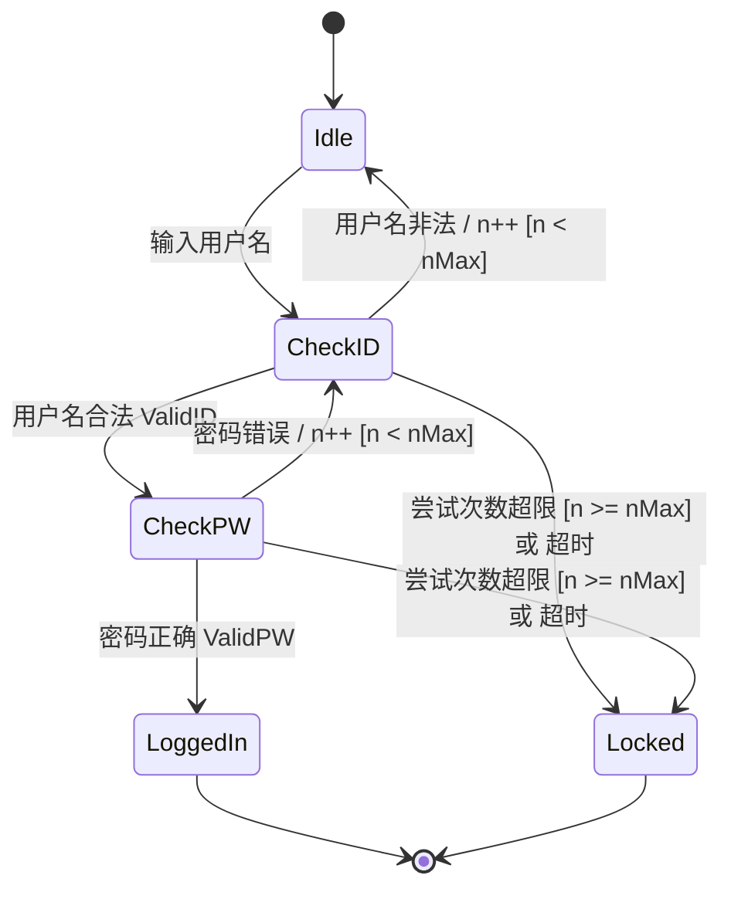

# 第05讲：软件质量管理与设计验证

- [ ] **质量管理与评审效率**：理解缺陷管理替代质量管理的逻辑，掌握为什么评审消除缺陷效率显著高于测试。
- [ ] **五大质量指标计算**：深入掌握 Yield (缺陷消除率)、A/FR (质检失效比)、PQI、DRL 与 Review Rate 的公式及大题。
- [ ] **PSP 设计模板**：熟悉 OST (操作)、FST (功能)、SST (状态) 和 LST (逻辑) 模板的作用与 UML 对应。
- [ ] **设计验证方法**：熟练掌握状态机验证（消除死锁与不可达）、逻辑表验证、执行表验证与数理逻辑证明。

---

## 🔑 PSP 质量管理与评审效率

* **缺陷管理替代质量管理**：为了使软件工作，产品必须基本没有缺陷。PSP 采用“缺陷管理”来等价替代质量管理，核心是通过高质量的个人评审在编译和测试前消除绝大多数缺陷。
* **为什么评审强于测试**：
  * **测试**发现异常行为后，需要消耗大量时间在后期进行“**调试定位原因 (Debug)**”。
  * **评审**时，遵循评审者的逻辑阅读代码，**发现缺陷的同时，也知道了缺陷的位置和原因**，能直接修正。

### 📊 评审过程与测试过程消除缺陷效率对比图

---

## 📐 五大质量控制指标与计算（大题必背）

1. **Yield (缺陷消除率)**：
   $$\text{Phase Yield} = 100 \times \frac{\text{本阶段发现的缺陷数}}{\text{本阶段注入缺陷数} + \text{进入本阶段前遗留的缺陷数}}$$
   $$\text{Process Yield} = 100 \times \frac{\text{第一次编译前发现的缺陷数}}{\text{第一次编译前注入的缺陷数}}$$
2. **A/FR (质检失效比)**：
   $$\text{A/FR} = \frac{\text{设计评审时间} + \text{代码评审时间}}{\text{编译时间} + \text{单元测试时间}}$$
   * **控制目标**：**期望目标值是 2.0**（即评审时间应是编译+测试时间的两倍，用于评估评审的充足性）。
3. **PQI (过程质量指数)**：
   表征模块开发中的规范化程度，由5个比率的乘积决定（设/编比 $\ge 1.0$、设评/设计 $\ge 0.5$、代评/编码 $\ge 0.5$、编译缺陷 $\le 10$ 个/KLOC、单测缺陷 $\le 5$ 个/KLOC）。
4. **Review Rate (评审速度)**：代码评审速度 $\le 200 \text{ LOC/小时}$；文档评审速度 $\le 4 \text{ 页/小时}$。
5. **DRL (缺陷消除效率比)**：度量某阶段发现缺陷的速率与单测发现速率的对比。

---

## 🎨 PSP 四大设计模板与 UML 的映射关系

为了在设计阶段消除二义性，PSP 提供了 4 个用于不同维度的结构化设计模板：

| PSP 设计模板 | 作用与描述信息 | 对应 UML 设计图 |
| :--- | :--- | :--- |
| **OST (操作规格模板)** | 描述用户与系统在**正常及异常场景**下的交互序列，直接用于设计系统测试用例。 | UML **用例图 (Use Case)** 和 **时序图 (Sequence)** |
| **FST (功能规格模板)** | 描述系统对外的**静态接口**（类、继承关系、对外属性和方法的型构与行为）。 | UML **类图 (Class Diagram)** |
| **SST (状态规格模板)** | 精确定义程序的**状态机**（所有状态名称、转换条件、转换动作）。 | UML **状态图 (Statechart)** |
| **LST (逻辑规格模板)** | 精确描述系统的**内部静态逻辑**（采用伪代码描述）。 | **UML 中无对应图示** |

---

## 🔒 四大详细设计验证手段（常考分析大题）

### 1. 状态机验证 (State Machine Verification)
* **完全正确的状态机标准**：无死循环、无陷阱状态、满足转换条件的**正交性**与**完整性**。

### 📊 状态机设计图示 (CheckID/CheckPW)

根据课件中的设计，状态机验证的典型图例如下：

### 2. 符号化执行验证 (Symbolic Execution)
* **原理**：将伪代码中的变量用代数符号表示，代入程序中进行逐步推导，得出最终输出的代数表达式。适合算法验证，但**不适用于有复杂控制流的场合**。

### 3. 执行表 (Execution Table) 与 跟踪表 (Tracking Table)
* **执行表**：逐步跟踪**特定单一测试用例**的关键变量变化情况。
* **跟踪表**：是执行表的升级版，融入了代数符号和多用例组合，可用于验证一般化场景下的行为。

### 4. 正确性检验 (Correctness Verification)
将伪代码当成数学定理，进行形式化证明。例如 While-Do 循环的检验，必须满足三个条件：
1. **终止条件**：循环条件最终一定会变为“假”。
2. **等价条件**：循环条件为“真”时，执行循环体一次再执行循环结构，其结果是否与直接执行该循环结构一致。
3. **不变量条件**：循环条件为“假”时，循环体内所有变量的值是否未被修改。

---

## ✍️ 练习题

#### Q1 关于PSP质量管理策略，下列说法中正确的是：
* A. 用缺陷管理替代质量管理，既有必要性，也有合理性
* B. 基本无缺陷的开发是通过开展高质量的评审来实现的
* C. 经过训练，评审是所有消除缺陷的手段当中最高效的
* D. PSP 质量策略主要解决的是外部质量，而非内部质量
* **正确答案**：ABC
* **解析**：PSP 采用缺陷管理替代质量管理（在代码行级，消除缺陷即代表提升质量，A正确）；基本无缺陷开发依靠高质量的设计与代码评审，测试通常漏过更多缺陷且调试耗时大，B、C 正确。D 错误，PSP 关注的是内部代码及设计逻辑的质量，属于内部质量。

#### Q2 关于DRL（缺陷消除效率比），下列说法中不正确的是：
* A. 这是一种模块级开发中质量控制的指标
* B. DRL 以单元测试每小时发现缺陷率作为基准，考察上游其他缺陷消除阶段的消除效率
* C. DRL 以单元测试发现的缺陷个数作为基准，考察上游其他缺陷消除阶段消除缺陷的效率
* D. DRL 只能预测，不能度量
* **正确答案**：CD
* **解析**：DRL 的基准是“单元测试发现缺陷率（缺陷数/小时）”，而不是缺陷“绝对个数”，C 错误（故选C）。DRL 可基于实际数据进行精确事后度量，D 错误（故选D）。

#### Q3 【2023真题】关于 DRL，下列说法中正确的是：
* A. 这是一种模块级开发中的度量模块开发质量的指标
* B. 该以单元测试发现的缺陷个数作为基准，考察上游其他缺陷消除阶段消除缺陷的效率
* C. DRL 只能预测，不能度量
* D. DRL 期望值是大于 2.0
* **正确答案**：D
* **解析**：A错误，DRL 属于过程控制质量度量指标而非模块静态质量本身；B、C错误，基准是单测发现缺陷的效率，且 DRL 可以被实际度量；D 正确，PSP 质量控制中要求评审 DRL 期望值大于 2.0。

#### Q4 【2023真题】关于 PQI，下列说法中不正确的是：
* A. PQI 表征模块级别开发中的过程规范化程度
* B. PQI 越高越好
* C. PQI 越低越好
* D. PQI 不仅仅可以用作质量规划，也能指导过程改进
* **正确答案**：C
* **解析**：PQI 取值处于 $0 \sim 1$ 之间，越接近 1（越高）说明过程越规范，质量控制越好。PQI 越低越好是不正确的说法。

#### Q5 关于PQI，下列说法中正确的是：
* A. PQI可以辅助判断模块开发质量
* B. PQI可以提供过程改进的依据
* C. PQI确保大于1，从而确保开发质量
* D. PQI只能预测，不能度量
* **正确答案**：AB
* **解析**：PQI 是 5 个 $0 \sim 1$ 比率的乘积，取值范围是 $[0, 1]$，无法大于 1，C 错误。PQI 是可以通过项目实际过程数据收集度量出来的，D 错误。

#### Q6 关于Yield（缺陷消除率），下列说法中正确的是：
* A. Yield 可以辅助判断模块开发质量
* B. Yield 可以提供过程改进的依据
* C. Yield 区分为 Process Yield 和 Phase Yield
* D. Yield 只能预测，不能度量
* **正确答案**：ABC
* **解析**：Yield 同样是可度量的过程绩效参数（如编译前 Yield 目标为 > 70%）。D 错误。

#### Q7 关于评审速度，下列说法中正确的是：
* A. 进行代码评审的时候，控制评审速度不超过每小时1000LOC就能实现大部分质量要求
* B. 实战中，评审速度应该根据资源水平而定，时间充分就评审慢一些
* C. 文档评审速度应该控制每小时不超过4页
* D. 评审速度与人的技能有关，技能强的人可以突破每小时1000 LOC代码这个限制
* **正确答案**：C
* **解析**：A、D 错误，优秀的评审速度应控制在 150~200 LOC/小时，超过 200 质量会迅速下滑，1000 LOC/小时根本起不到评审效果；B 错误，评审速度主要由人的生理注意力和认知负荷决定，不能弹性改变。C 正确。

#### Q8 【2023真题】关于 Humphrey 梳理的 Quality Journey，下列说法中不正确的是：
* A. Quality Journey 中列出的步骤可以按需要更换顺序
* B. 加强团队形式的评审是 Quality Journey 后期的步骤
* C. Quality Journey 仍然仅仅是在“用缺陷管理替代质量管理”这一基本策略之下进行讨论
* D. Quality Journey 中测试应该先于评审得到贯彻和改善
* **正确答案**：A
* **解析**：Quality Journey 有严格的先后演进关系，不能随意更换顺序。

#### Q9 下述设计模板中用来记录内部动态信息的是：
* A. OST
* B. SST
* C. LST
* D. FST
* **正确答案**：B
* **解析**：SST（状态规格模板）精确定制状态机，记录状态转移等内部动态信息。

#### Q10 下述关于PSP四大设计模板和UML典型设计图的描述中完全正确的是：
* A. OST 在 UML 中没有对应的设计图
* B. UML 中的类结构以及类之间的关系，在PSP四大设计模板中无法体现
* C. LST 在 UML 中可以通过类图来体现
* D. FST 在 UML 中可以通过类图来体现
* **正确答案**：BD
* **解析**：OST 对应时序图/用例图；LST 描述逻辑伪代码，UML 中没有对应静态表示图；FST 描述对外静态接口，对应 UML 类图。B 正确，PSP 模板关注单个模块，无法体现 UML 中复杂的类间关系。

#### Q11 【2023真题】一个完全正确的状态机应该满足：
* A. 没有死循环和陷阱
* B. 状态转化条件满足正交性
* C. 状态转化条件满足完整性
* D. 符合设计意图
* **正确答案**：ABC
* **解析**：状态机结构正确性的数学判定标准包含：无死循环/陷阱、完整性（对任何可能输入有转换处理）、正交性（转换条件互斥，转移唯一）。

#### Q12 【2023真题】下列关于各种设计验证手段的描述中不正确的是：
* A. 受限于手工方式，都易于出错
* B. 跟踪表是唯一一种提供全面设计验证的手段
* C. 符号化执行不适合验证复杂的数学计算
* D. 执行表是跟踪表的扩展
* **正确答案**：BC
* **解析**：没有“唯一”全面手段，B 错误；符号化执行最适合数学计算，但不适合复杂逻辑分支，C 错误。

#### Q13 关于使用程序正确性证明手段验证while-do循环设计的描述中，正确的是：
* A. 如果设计是正确的，那么应满足的条件之一是循环判断条件最后一定可以变为false
* B. 如果设计是正确的，那么应满足的条件之一是循环判断条件为真的时候，单独的循环结构执行结果与循环体再加一个循环结构，其执行结果一致
* C. 如果设计是正确的，那么应满足的条件之一是循环判断条件为false的时候，循环体内所有变量不能被修改
* D. 该方法并不能保证循环体算法实现设计意图
* **正确答案**：ABCD
* **解析**：循环不变式验证条件：A 为终止条件；B 为等价/步进条件；C 为条件为假时不修改变量；D 正确，证明只能保证一致性，如果规格本身偏离设计意图，证明也无法纠正。
