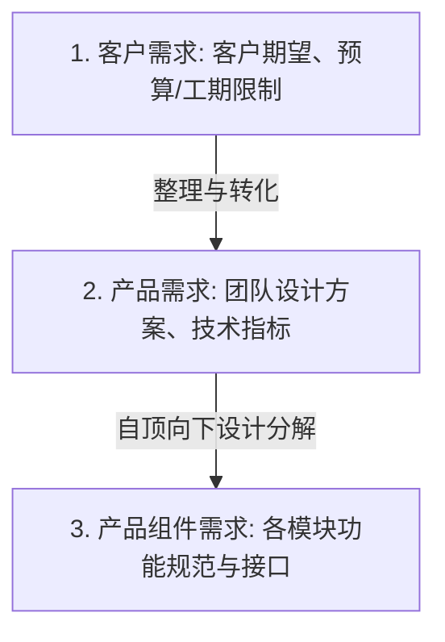
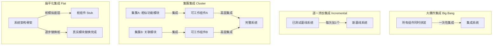
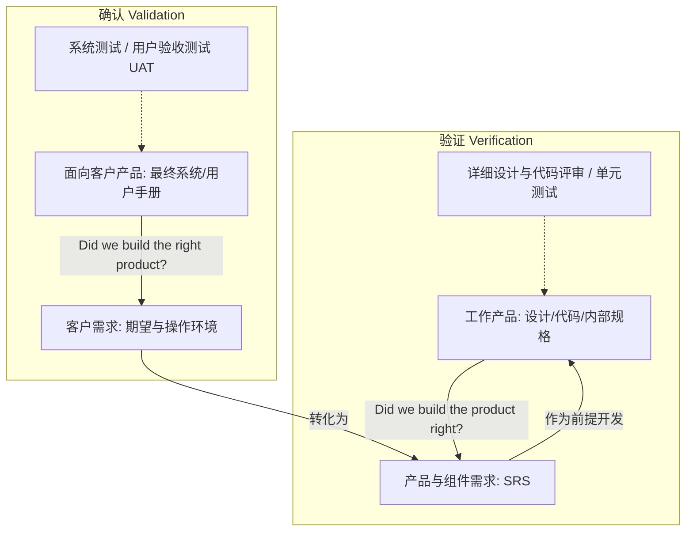

# 第06讲：团队工程开发 (需求, 设计, 实现, 集成, V&V)

- [ ] **需求开发与 SRS 特征**：掌握客户需求、产品需求与产品组件需求关系，理解 SRS 优秀十特征。
- [ ] **设计标准与自底向上实现**：掌握自顶向下设计、自底向上编码的优势，理解复用性及减少桩模块的逻辑。
- [ ] **四大集成策略**：深入对比大棒集成、增量集成、分阶段集成及日构建与持续集成的差异与适用场景。
- [ ] **验证 (Verification) 与确认 (Validation)**：熟练辨析两者的定义、差异（"Did we build the system right?" vs "Did we build the right system?"）与交互。

---

## 🔑 需求开发与 SRS 规格特征

* **需求的三级分类**：客户需求（客户业务期望与限制条件）、产品需求（开发团队的技术解决方案）、产品组件需求（更低层次的组件接口）。
* **优秀需求规格说明书 (SRS) 的特征**：内聚、完整、一致、原子、可跟踪、非过期、可行、非二义性、强制性、可验证。

### 📊 需求开发级别传递关系图

---

## 🎨 团队设计与自底向上实现策略

* **设计标准**：定义命名规范、接口标准、系统出错异常信息规范、以及设计表示标准（如 PSP 模板）。
* **自底向上 (Bottom-Up) 编码实现策略**：
  * **策略**：设计时采用**自顶向下，逐步求精**（建立整体观）；实现时采用**自底向上**。
  * **优势**：先开发底层模块，对其进行严格评审并消灭缺陷，使得后续高层开发能构建在“坚实质量基础的底层模块”之上；底层模块越早实现，被其他模块复用的机会就越多；底层已经被实现，高层开发时无需大量编写模拟返回值的桩模块（Stub）。

---

## ⚖️ 对比分析：4大系统集成策略

### 📊 4大系统集成策略机制图示

* **大爆炸集成**：一次性装配。用例最少，但**极难定位缺陷位置**。仅适用于组件质量极高的情况。
* **逐一添加集成**：每次加一个。**极易定位缺陷**，但回归测试次数最多，极其耗时。
* **集簇集成**：关联模块优先集成。**可尽早获得可以运行的核心子系统**，但系统级接口错误暴露较晚。
* **扁平化集成**：优先集成控制骨架，底层打桩。**能尽早暴露并测试系统级别、架构级别的接口错误**，但需要编写大量桩。

---

## ⚖️ 核心对比：验证 (Verification) VS. 确认 (Validation)

这是期末考试中最经典的概念对比：

* **验证 (Verification)**：
  * **定义**：确保选定的工作产品符合事先指定的需求（“**Did we build the product right?**”）。
  * **基准**：产品需求和产品组件需求（SRS）。
  * **对象**：**工作产品 (Work Products)**（内部设计图、详细设计、源代码）。
  * **活动**：详细设计评审、代码评审、单元测试、集成测试。
* **确认 (Validation)**：
  * **定义**：确保产品在预期的使用和操作环境中工作正确，满足客户的业务诉求（“**Did we build the right product?**”）。
  * **基准**：客户需求、操作概念与场景。
  * **对象**：**产品 (Products)**（面向客户的可交付成果，如部署后的系统、用户手册）。
  * **活动**：产品需求评审、系统测试、用户验收测试 (UAT)、试运行。

### 📊 验证 (Verification) 与 确认 (Validation) 区别图

---

## ✍️ 练习题

#### Q1 【2023真题】下面描述属于典型客户需求的是：
* A. 客户期望
* B. 预算限制
* C. 法律法规限制
* D. 系统功能描述

#### Q2 在团队设计活动中，应该注意设计标准，下列属于典型的设计标准应该约定的是：
* A. 命名规范
* B. 接口标准
* C. 出错或者异常处理信息
* D. 设计表示方式

#### Q3 典型地，在团队设计活动中，应该注意哪些内容：
* A. 设计标准的应用
* B. 复用的考虑
* C. 可测试性支持
* D. 可用性支持

#### Q4 【2023真题】关于集成策略，下述描述中正确的是：
* A. 当待集成组件质量普遍不高的时候，不可以使用扁平化策略
* B. 当需要尽早获取可以工作的组件的时候，应该使用集簇式策略
* C. 当待集成组件质量普通较高的时候，可以使用大爆炸式集成策略
* D. 持续集成本质上就是逐一添加策略

#### Q5 当考虑集成策略的时候，应该注意如下哪些方面？
* A. 待集成组件的质量状态
* B. 待集成组件的获取方式
* C. 待集成组件的功能和关系
* D. 待集成组件的数量

#### Q6 关于扁平化集成策略和集簇式集成策略，下述说法中正确的是：
* A. 扁平化策略可以较早地充分地暴露系统级别的错误
* B. 扁平化策略对于系统级别错误的暴露能力有限
* C. 集簇式集成策略有助于复用策略的实现
* D. 扁平化策略和集簇式策略的优缺点正好相反

#### Q7 下述活动是典型的验证（Verification）的是：
* A. 需求评审
* B. 详细设计评审
* C. 单元测试
* D. 试运行

#### Q8 下述活动是典型的确认（Validation）的是：
* A. 验收测试
* B. 代码评审
* C. 系统测试
* D. 持续集成

#### Q9 下述产物中属于典型的确认（Validation）对象的是：
* A. 接口设计文档
* B. 源代码
* C. 用户手册
* D. 系统使用培训材料（视频、录像等）

#### Q10 下述关于需求开发的描述中，哪些是正确的？
* A. 客户需求是指客户提出的关于软件功能的具体要求
* B. 工期或者预算往往都是客户需求的一个方面
* C. 产品需求需要跟客户充分讨论才能获取
* D. 客户应该在需求开发活动中起到主导作用

#### Q11 [主观题] 【2023真题】随着 ChatGPT 的横空出世，以大模型为代表的 AI 技术势必对各行各业带来前所未有的影响。具体到软件工程，人工智能技术的应用也日渐常见，请结合这一背景畅想下本课程涉及的若干话题可能在这一波 AI 浪潮中的挑战和机遇。至少应该包括如下话题：项目管理、质量管理、过程改进。
