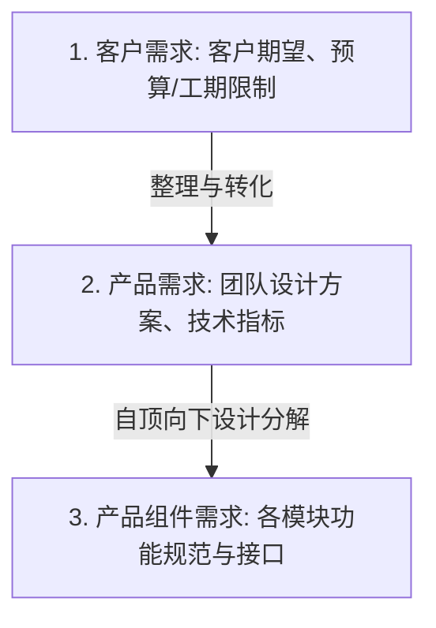
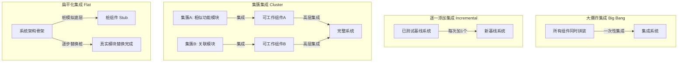
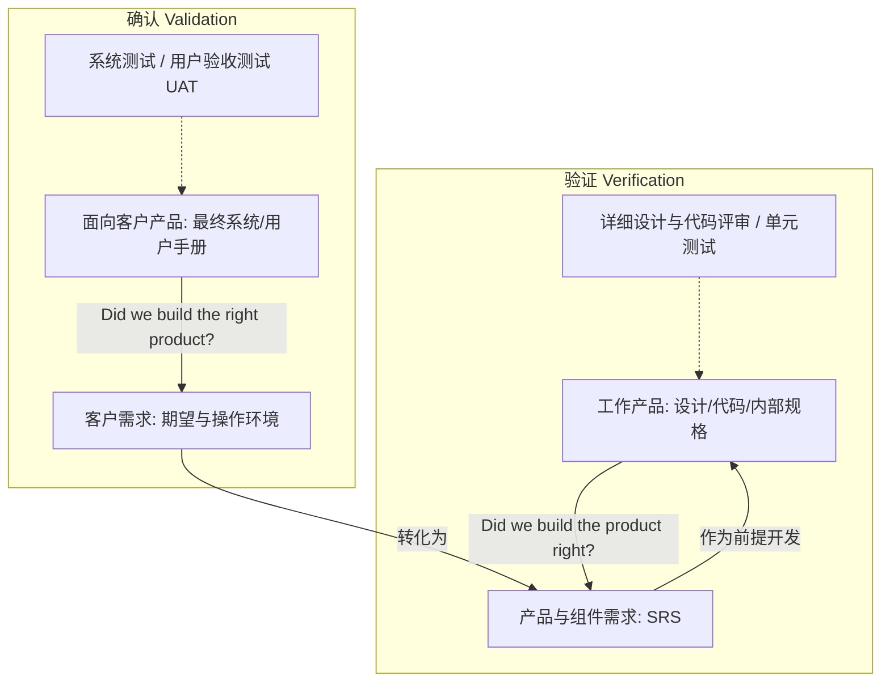

# 第06讲：团队工程开发 (需求, 设计, 实现, 集成, V&V)

- [ ] **需求开发与 SRS 特征**：掌握客户需求、产品需求与产品组件需求关系，理解 SRS 优秀十特征。
- [ ] **设计标准与自底向上实现**：掌握自顶向下设计、自底向上编码的优势，理解复用性及减少桩模块的逻辑。
- [ ] **四大集成策略**：深入对比大棒集成、增量集成、分阶段集成及日构建与持续集成的差异与适用场景。
- [ ] **验证 (Verification) 与确认 (Validation)**：熟练辨析两者的定义、差异（"Did we build the system right?" vs "Did we build the right system?"）与交互。

---

## 🔑 需求开发与 SRS 规格特征

* **需求的三级分类**：客户需求（客户业务期望与限制条件）、产品需求（开发团队的技术解决方案）、产品组件需求（更低层次的组件接口）。
* **优秀需求规格说明书 (SRS) 的特征**：内聚、完整、一致、原子、可跟踪、非过期、可行、非二义性、强制性、可验证。

### 📊 需求开发级别传递关系图

---

## 🎨 团队设计与自底向上实现策略

* **设计标准**：定义命名规范、接口标准、系统出错异常信息规范、以及设计表示标准（如 PSP 模板）。
* **自底向上 (Bottom-Up) 编码实现策略**：
  * **策略**：设计时采用**自顶向下，逐步求精**（建立整体观）；实现时采用**自底向上**。
  * **优势**：先开发底层模块，对其进行严格评审并消灭缺陷，使得后续高层开发能构建在“坚实质量基础的底层模块”之上；底层模块越早实现，被其他模块复用的机会就越多；底层已经被实现，高层开发时无需大量编写模拟返回值的桩模块（Stub）。

---

## ⚖️ 对比分析：4大系统集成策略

### 📊 4大系统集成策略机制图示

* **大爆炸集成**：一次性装配。用例最少，但**极难定位缺陷位置**。仅适用于组件质量极高的情况。
* **逐一添加集成**：每次加一个。**极易定位缺陷**，但回归测试次数最多，极其耗时。
* **集簇集成**：关联模块优先集成。**可尽早获得可以运行的核心子系统**，但系统级接口错误暴露较晚。
* **扁平化集成**：优先集成控制骨架，底层打桩。**能尽早暴露并测试系统级别、架构级别的接口错误**，但需要编写大量桩。

---

## ⚖️ 核心对比：验证 (Verification) VS. 确认 (Validation)

这是期末考试中最经典的概念对比：

* **验证 (Verification)**：
  * **定义**：确保选定的工作产品符合事先指定的需求（“**Did we build the product right?**”）。
  * **基准**：产品需求和产品组件需求（SRS）。
  * **对象**：**工作产品 (Work Products)**（内部设计图、详细设计、源代码）。
  * **活动**：详细设计评审、代码评审、单元测试、集成测试。
* **确认 (Validation)**：
  * **定义**：确保产品在预期的使用和操作环境中工作正确，满足客户的业务诉求（“**Did we build the right product?**”）。
  * **基准**：客户需求、操作概念与场景。
  * **对象**：**产品 (Products)**（面向客户的可交付成果，如部署后的系统、用户手册）。
  * **活动**：产品需求评审、系统测试、用户验收测试 (UAT)、试运行。

### 📊 验证 (Verification) 与 确认 (Validation) 区别图

---

## ✍️ 练习题

#### Q1 [多选] 【2023真题】下面描述属于典型客户需求的是：
* A. 客户期望
* B. 预算限制
* C. 法律法规限制
* D. 系统功能描述
* **正确答案**：ABC
* **解析**：客户需求包括业务期望（A）以及各种外部约束限制（B、C）。D“系统功能描述”是开发人员编写的“产品需求”或“产品规格”，属于偏技术方案。

#### Q2 [多选] 在团队设计活动中，应该注意设计标准，下列属于典型的设计标准应该约定的是：
* A. 命名规范
* B. 接口标准
* C. 出错或者异常处理信息
* D. 设计表示方式
* **正确答案**：ABCD
* **解析**：这四个全属于设计标准的范畴，用于保证团队协作设计的一致性。

#### Q3 [多选] 典型地，在团队设计活动中，应该注意哪些内容：
* A. 设计标准的应用
* B. 复用的考虑
* C. 可测试性支持
* D. 可用性支持
* **正确答案**：ABCD
* **解析**：团队设计不仅关注标准应用与接口复用，还要通过架构支持系统的可测试性以及在操作场景下支持系统的最终可用性。

#### Q4 [单选] 【2023真题】关于集成策略，下述描述中正确的是：
* A. 当待集成组件质量普遍不高的时候，不可以使用扁平化策略
* B. 当需要尽早获取可以工作的组件的时候，应该使用集簇式策略
* C. 当待集成组件质量普通较高的时候，可以使用大爆炸式集成策略
* D. 持续集成本质上就是逐一添加策略
* **正确答案**：C
* **解析**：组件质量很高且稳定时，大爆炸集成（直接全部组装）效率最高最省测试用例（C正确）。质量不高仍可打桩做扁平化（A错误）；尽早获取系统工作组件应使用扁平化（自顶向下），而非集簇式（B错误）；持续集成是高频频繁集成实践，不等同于单调的逐一添加策略（D错误）。

#### Q5 [多选] 当考虑集成策略的时候，应该注意如下哪些方面？
* A. 待集成组件的质量状态
* B. 待集成组件的获取方式
* C. 待集成组件的功能和关系
* D. 待集成组件的数量
* **正确答案**：ABCD
* **解析**：选择集成策略时，组件质量、开发/外购/复用获取方式、功能依赖关系、组件数量均是必须考虑的关键维度。

#### Q6 [多选] 关于扁平化集成策略和集簇式集成策略，下述说法中正确的是：
* A. 扁平化策略可以较早地充分地暴露系统级别的错误
* B. 扁平化策略对于系统级别错误的暴露能力有限
* C. 集簇式集成策略有助于复用策略的实现
* D. 扁平化策略和集簇式策略的优缺点正好相反
* **正确答案**：ACD
* **解析**：扁平化（自顶向下）集成骨架能极早暴露系统级架构和接口错误，但对底层复杂状态覆盖不足。集簇式正相反，有利于底层组件的复用和深度测试，但缺乏系统整体观。二者优缺点互补，故 D 正确。

#### Q7 [多选] 下述活动是典型的验证（Verification）的是：
* A. 需求评审
* B. 详细设计评审
* C. 单元测试
* D. 试运行
* **正确答案**：BC
* **解析**：详细设计评审与单元测试核对工作产品是否符合规格，属于验证（Verification）；需求评审与试运行核对系统是否符合客户实际环境期望，属于确认（Validation）。

#### Q8 [多选] 下述活动是典型的确认（Validation）的是：
* A. 验收测试
* B. 代码评审
* C. 系统测试
* D. 持续集成
* **正确答案**：AC
* **解析**：验收测试和系统测试（系统测试主要面向系统级功能和操作场景）直接核对产品级功能，属于确认（Validation）。

#### Q9 [多选] 下述产物中属于典型的确认（Validation）对象的是：
* A. 接口设计文档
* B. 源代码
* C. 用户手册
* D. 系统使用培训材料（视频、录像等）
* **正确答案**：CD
* **解析**：用户手册与培训材料直接面向最终用户，是最终交付产品的一部分，为确认（Validation）对象。接口文档与源代码是中间过程工作产品，为验证（Verification）对象。

#### Q10 [多选] 下述关于需求开发的描述中，哪些是正确的？
* A. 客户需求是指客户提出的关于软件功能的具体要求
* B. 工期或者预算往往都是客户需求的一个方面
* C. 产品需求需要跟客户充分讨论才能获取
* D. 客户应该在需求开发活动中起到主导作用
* **正确答案**：B
* **解析**：工期、预算、法律法规都属于限制条件，是客户需求的子集。客户需求除功能外还包含许多限制；产品需求是开发团队设计的技术方案，无需与客户直接讨论；开发团队应当在需求开发（获取与分析）中起到诱导和开发的主导作用。

#### Q11 [主观题] 【2023真题】随着 ChatGPT 的横空出世，以大模型为代表的 AI 技术势必对各行各业带来前所未有的影响。具体到软件工程，人工智能技术的应用也日渐常见，请结合这一背景畅想下本课程涉及的若干话题可能在这一波 AI 浪潮中的挑战和机遇。至少应该包括如下话题：项目管理、质量管理、过程改进。
* **参考答案**：
  1. **项目管理**：
     * **机遇**：大模型可以辅助生成 WBS。基于大量历史数据，AI 能辅助项目经理进行更精准的规模与成本估算，实时监控度量偏差并发出警警。
     * **挑战**：AI 辅助开发效率波动剧烈，导致传统基于“工时”的生产率基线失效；AI 生成资产的产权与安全风险管理变得复杂。
  2. **质量管理**：
     * **机遇**：AI 可降低静态代码评审与设计验证（符号执行、程序证明）成本，能自动化生成并执行单元测试，将缺陷消灭在源头。
     * **挑战**：AI 的“幻觉”缺陷不易被常规审查察觉；同时可能带来“单元测试覆盖率注水”现象（因为代码和用例均为 AI 生成）。
  3. **过程改进**：
     * **机遇**：AI 能自动记录开发度量指标（缺陷注入/消除阶段、修复时间），减轻开发人员手工填写 PSP 日志负担，提高高成熟度过程数据可信度。
     * **挑战**：过程改进和评估对象从“人类”转为“人机协同”，原有的过程规范性评价指数（如 PQI）公式与改进元模型需要重新裁剪。
