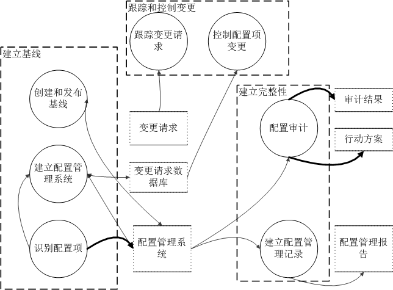
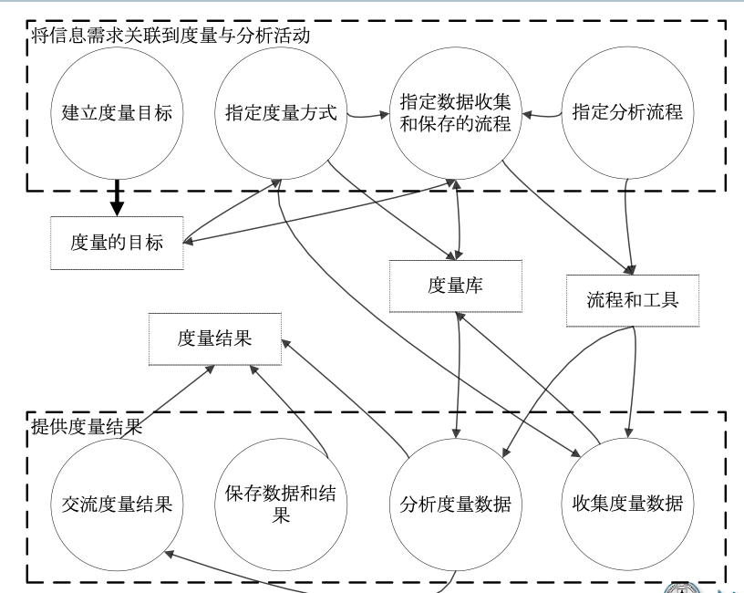
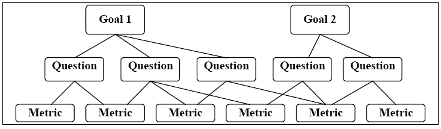
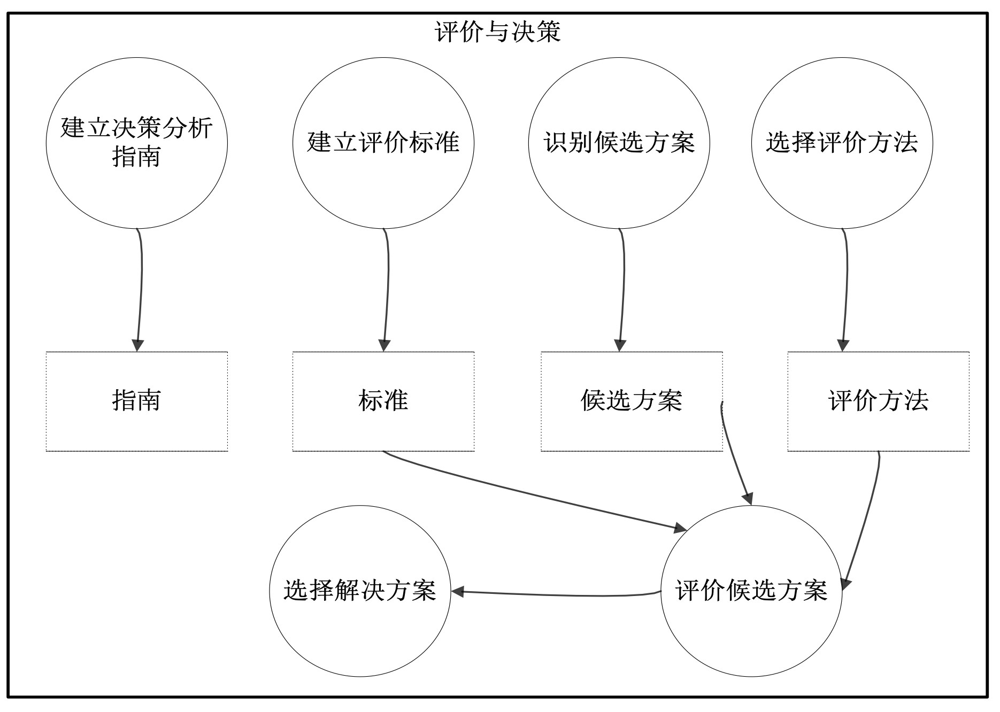
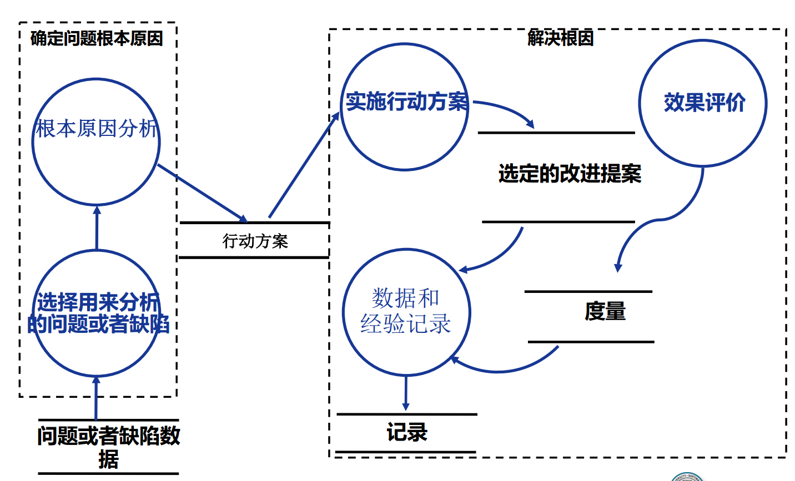
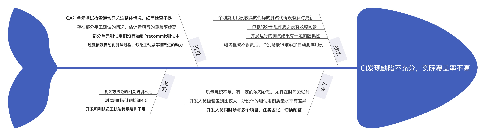

# 第07讲：项目支持活动 (配置管理, 度量, 决策与根因分析)

本文主要内容来自 [SpriCoder 的博客](https://spricoder.github.io/)，更换了更清晰的图片并根据新的课程设计做了补充和修正。

## 本讲要解决的问题

1. 配置管理的意义是什么？
2. 为什么要实施度量和分析活动？
3. 团队分析决策是如何开展的？
4. 鱼骨图和根因分析

## 项目管理支持活动

1. 配置管理
2. 度量和分析
3. 决策分析
4. 根因分析

## 配置管理

### 配置管理基本概念

配置项：

1. 在配置管理当中作为单独实体进行管理和控制的工作产品集合
2. 典型的可能作为配置项纳入配置管理的工作产品包含过程说明文档、项目开发计划文档、需求规格说明书、设计规格说明书、设计图表、产品规格说明书、程序代码、开发环境，如特定版本的编译器等、产品数据文件、产品技术文件、用户支持文档

基线：基线是一个或多个配置项及相关的标识符的代表，是一组经正式审查同意的规格或工作产品集合，是未来开发工作或交付的基础，而且只能经由严格的变更控制程序才能改变。

1. 发布一个基线包括该基线所有的配置项以及这些配置项的最新变更，因此，可以将基线作为接下来工作的基础。
2. 典型的发布基线时间点为需求分析之后、设计完成之后、单元测试之后以及最终产品发布。
3. 是配置项持续演进的稳定基础

### 配置管理简介

1. 配置管理的目的是建立与维护工作产品的完整性
2. 配置管理的活动
3. 配置管理的对象

### 配置管理活动

### 配置管理的流程

> 配置管理是用管理的手段监督和指导如下工作的流程[CMMI 2006]

1. 识别和记录配置项的物理特性和功能特性
2. 控制上述特性的变更；
3. 记录和报告变更过程和相应的配置项状态
4. 验证配置项是否与需求一致

### 配置管理活动

1. 识别配置项
2. 建立配置管理系统
3. 创建和发布基线
4. 跟踪变更请求
5. 控制配置项变更
6. 建立配置管理记录
7. 配置审计

## 度量和分析

度量与分析的意义。

作为项目管理支持类的活动，度量和分析活动可以支持如下的项目管理活动：

1. 客观的估计与计划
2. 根据建立的计划和目标，跟踪实际进展
3. 识别与解决过程改进相关议题
4. 提供将度量结果纳入未来其他过程的基础

### 度量与分析活动

### GQM 方法简介

#### GQM 示例-PM

1. G: 确保稳定性、可预测性的开发过程来满足计划的里程碑。
2. Q: 我的项目是否按照计划的轨迹前进，计划的里程碑都能实现吗？
3. M: 软件项目开发工作的挥发性（分支、流、变更管理（UCM）活动）。

#### GQM 示例-DM

1. G: 最大化所有团队贡献者的生产力。
2. Q: 开发人员能够完成分配给他们的任务吗，或者他们遇到障碍了吗？
3. M: 由个体或者工作组产生的项目工件的数量

## 决策分析

决策分析的意义：错误的决策往往会给项目带来灾难性后果。为了降低这种错误决策的风险，往往需要尽可能基于客观事实和正确的流程来开展决策与分析活动

困难：

一个正式评估过程往往包含下列的活动：

1. 建立评估备选方案的准则
2. 识别备选解决方案
3. 选择评估备选方案的方法
4. 使用已建立的准则与方法，评估备选解决方案
5. 依据评估准则，从备选方案中选择建议方案

### 决策分析活动

### 决策分析练习

某基于 WEB 的信息系统的技术选型

1. 选择标准有哪些？
2. 可选方案有哪些？
3. 怎么评价

## 根因分析与解决方案

1. 避免类似错误反复发生
2. 一个正式根因分析过程往往包含下列的活动：
       1. 识别和选定问题
       2. 根因分析
       3. 建立改进的行动方案
       4. 实施改进，评估效果

### 根因分析活动

### 根因分析典型示例

典型角度：技术角度 、人员角度、 培训角度、过程角度

---

## ✍️ 模拟选择题（概念考察，无答案）

#### Q1 配置管理（CM）是保障项目资产完整性的关键活动。关于配置审计（Configuration Audit），下列说法正确的是：
* A. 功能配置审计（FCA）用于验证配置项的实际性能是否符合其对应的需求规格说明
* B. 物理配置审计（PCA）用于核对实际的配置项版本和数量是否与物理清单/配置管理记录一致
* C. 配置审计必须由外部专业的审计机构或外部QA来执行，项目组内部不能开展自我审计
* D. 物理配置审计不仅核对物理清单，还需要对代码的内部逻辑进行详细评审和重构

#### Q2 目标-问题-度量（GQM）方法是一种面向目标的软件度量指标提取框架。以下关于 GQM 框架的理解中，哪些是正确的：
* A. 目标层（Goal）定义了度量的动机，例如“确保开发过程的可预测性与稳定性”
* B. 问题层（Question）关注如何评估目标是否达成，例如“项目进度是否按计划走”
* C. 度量层（Metric）是指用于回答相关问题的具体数值指标，例如进度偏差 SV 或需求挥发度
* D. 在 GQM 实践中，应该先盲目收集大量的代码度量数据，然后再根据数据倒推项目的商业目标

#### Q3 决策分析与评估（DAR）是 CMMI 中的重要实践。在制定决策分析指南时，最核心、最关键的内容是：
* A. 明确评估备选方案的数学打分公式
* B. 明确在什么情况下触发并开展正式的决策分析活动（即触发准则）
* C. 罗列出行业内所有可能的备选解决方案
* D. 确定最终决策审批人是项目经理还是公司高管

#### Q4 缺陷根因分析（RCA）是实现缺陷预防的重要活动。下列关于 RCA 活动的叙述中，正确的是：
* A. 根因分析的最根本目的是找出引入缺陷的“责任人”并对其进行处罚
* B. 鱼骨图（Ishikawa Diagram）是一种常用的 RCA 工具，可以从技术、人员、过程、培训等维度分析因果关系
* C. 根因分析活动终止的唯一特征是讨论出针对当前缺陷的临时修复方案
* D. RCA 必须形成闭环，即完成改进方案的实施、评估效果，并将经验和度量数据更新到组织历史数据库中

#### Q5 在配置管理系统中，下列哪些工作产品适合作为配置项（CI）进行独立管理和演进：
* A. 需求规格说明书与设计规格说明书
* B. 源代码与特定版本的编译器/第三方依赖库
* C. 项目经理每天随手写在草稿纸上的临时备忘录
* D. 用户使用手册与系统安装部署脚本

#### Q6 决策评估过程中建立评价准则（Criteria）时，决策团队应当考虑哪些方面：
* A. 评价准则的权重划分应当体现项目和决策者的利益诉求
* B. 候选解决方案的识别一般应该在确定评价准则之后进行
* C. 评价准则一经制定就绝对不能更改，即使发现有严重的评估漏洞
* D. 选择的评估方法（如打分矩阵）应当与评估的准则和项目上下文相匹配

