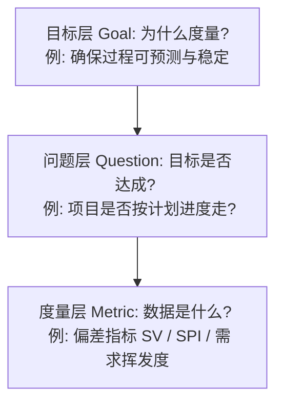
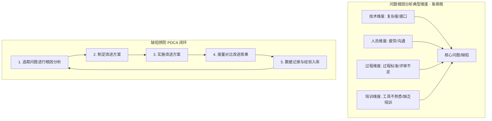

# 第07讲：项目支持活动 (配置管理, 度量, 决策与根因分析)

- [ ] **配置管理 (CM) 核心概念**：掌握配置项（CI）与基线的定义，深刻理解功能配置审计（FCA）与物理配置审计（PCA）的区别。
- [ ] **软件度量与 GQM 方法**：掌握 Goal-Question-Metric 框架的含义与应用层级。
- [ ] **决策分析与评估 (DAR)**：掌握决策评估的过程，以及何时应当使用 DAR 机制。
- [ ] **缺陷根因分析 (RCA)**：掌握缺陷根因分析三步法、PDCA 闭环以及 5 Whys 根因分析技巧。

---

## 🔑 配置管理 (CM)

* **配置项 (CI, Configuration Item)**：配置管理中作为单独实体进行管理和控制的工作产品。典型配置项包括需求文档、设计规格、源代码、**开发环境（如特定版本的编译器、库依赖）**。
* **基线 (Baseline)**：配置项持续演进的稳定基础。典型基线发布点为需求分析后、设计完成后、测试完成后、产品发布。
* **配置审计**：
  * **功能配置审计 (FCA)**：验证配置项的实际性能是否符合其需求规格。
  * **物理配置审计 (PCA)**：核对实际的配置项数量和版本是否与配置管理记录中的**物理清单（配置项列表）**完全一致，检查是否存在遗漏或未经授权的修改。

---

## 📐 软件度量的 GQM 方法 (Goal-Question-Metric)

度量体现了决策者对要实现的目标的关切程度。GQM 是一种面向目标的度量指标提取框架：

### 📊 GQM 目标度量拆解图

---

## 🛠️ 决策分析与评估 (DAR) 流程

当项目面临重大技术选型（如架构选型、核心组件外购与自研决策）时，需启动 DAR 流程：
1. **确定触发准则**：明确什么场合下必须开展正式决策分析活动（这是决策指南中最关键的部分）。
2. **建立评估准则 (Criteria)**：明确用于评估方案的各项标准及其权重。
3. **识别备选解决方案 (Options)**：收集并识别可选的竞争方案。
4. **选择评估方法**：打分矩阵或模拟等。
5. **评估与选择建议方案**：综合打分并向管理层推荐。

---

## 🔍 根因分析 (RCA) 与缺陷预防

根因分析的目的是识别问题的根本原因，以便采取预防性措施，防止类似错误在未来反复发生。

### 📊 RCA 鱼骨图与闭环控制流程

* **终止标准**：根因分析活动决不终止于“找到解决方案”，而必须是**完成改进方案实施、完成改进效果评估（对比数据），并完成经验数据入库**的闭环过程。

---

## ✍️ 练习题

#### Q1 [多选] 【2023真题】关于 PSP 缺陷日志，哪些信息是至关重要的？
* A. 缺陷发现时间
* B. 缺陷重现方式
* C. 缺陷根因描述
* D. 缺陷关联的其他缺陷
* **正确答案**：AC
* **解析**：PSP 缺陷日志必填核心字段包括缺陷编号、发现日期/时间、注入阶段、消除阶段、修复时间、缺陷描述。缺陷重现方式是常规测试管理工具的要素而非个人 PSP 缺陷日志。

#### Q2 [多选] 下述产物中属于典型的配置项是：
* A. 接口设计文档
* B. 源代码
* C. 用户手册
* D. 系统使用培训材料（视频、录像等）
* **正确答案**：ABCD
* **解析**：配置项是被纳入配置管理、进行版本和变更控制的独立工作产品。文档、源代码、手册、培训视频等皆可作为配置项。

#### Q3 [单选] 团队内部的配置审计通常应该关注什么：
* A. 物理审计
* B. 配置项列表
* C. 配置管理记录
* D. 基线计划
* **正确答案**：A
* **解析**：功能配置审计（FCA）验证功能一致性，物理配置审计（PCA）核对实际配置项与配置管理清单的一致性。物理审计（A）是团队内部配置审计的核心，重点核对物理资产的一致性（包含配置项列表和记录）。

#### Q4 [单选] 下列关于决策分析的论述中，不恰当的是：
* A. 决策分析指南中最关键的是明确需要开展决策分析活动的判定标准，即什么场合之下需要开展正式的决策分析活动
* B. 评价方法是体现决策者利益诉求的关键，因此，需要谨慎设计
* C. 候选方案的识别应该晚于评价标准
* D. 现实生活中的项目投标就是一个典型的决策分析活动
* **正确答案**：C
* **解析**：决策分析与解决（DAR）中，识别候选解决方案与确定评价标准通常是并行或交织在一起的，不存在严格的前后继承关系，因此 C 说法不恰当。

#### Q5 [单选] 下列关于根因分析的论述中，不恰当的是：
* A. 根因分析必须基于丰富的数据来选择合适的问题
* B. 鱼骨图是根因分析的有效手段
* C. 典型地，可以从技术、人员、培训以及过程角度开展根因分析
* D. 根因分析活动终止的唯一特征就是找到相应的根因的明确解决方案
* **正确答案**：D
* **解析**：根因分析活动决不能终止于“找到方案”，而必须包含方案的实施、改进效果的定量评估、以及组织过程资产和经验库的更新，是一个闭环 PDCA 过程，因此 D 不恰当。
